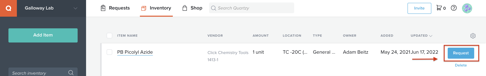
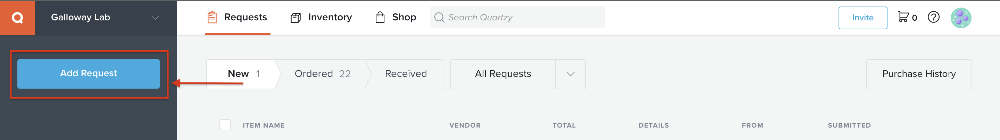
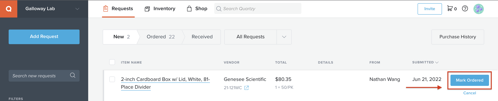
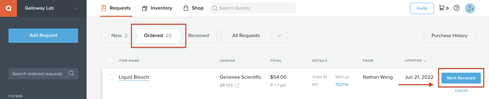

====================================
Ordering
====================================

Direct ordering through Coupa
-----------------------------

MIT's ordering system is accessible at https://mit.coupahost.com. After logging in, there is a large list of suppliers
on the right that are available for "punchout", i.e. you can just add to cart and checkout inside Coupa.

On the Coupa checkout screen, fill out the following information:

- **Address**: Under the \'Ship To\' tab, click the magnifying glass. Search for \'Building 66\' and select the standard delivery option. This is 32 Vassar St, the main receiving area for MIT deliveries.

    .. image:: ../img/ordering-address.png

- In the \'Attention\' box, add your name with the lab address in parentheses, i.e., \'Your Name (66-219)\'.

    .. image:: ../img/ordering-review-cart.png

- **Billing**: For each item, choose the correct item type (e.g., General Lab Supplies) and click the magnifying glass to choose the PO to charge.

    .. image:: ../img/ordering-account-1.png

- The PO can be found by searching \'Galloway\' and selecting an option from the list (e.g., \'Start-Up Funds\').

    .. image:: ../img/ordering-account-2.png

- Double check that the Approver workflow is accurate (i.e., through ChemE) and submit the order.

    .. image:: ../img/ordering-approvers.png

After placing the order through Coupa, be sure to add the items to Quartzy (see below). This helps organize the lab inventory and facilitates re-ordering.

Requests through Quartzy
------------------------

There are three scenarios for adding requests to Quartzy: re-ordering an item in the inventory, making a new request for an item to be ordered, and adding an item already ordered through Coupa.

.. tip::
    To check the current item price, search for the item from the relevant supplier in Coupa. Be sure to log in to see the discounted MIT prices!

**Re-Ordering**

To request an item already in the inventory, select the item and click on the \'Request\' button. Double check that the catalog number, price, and quantity are correct, then click \'Request\' to submit the request for Tseganesh to order.

**New Requests**

To request a new item, select the \'Requests\' tab and click the \'Request\' button in the top left corner of the page. Search for the item by Manufacturer and Catalog Number.
There are two suppliers to choose from: the \'Quartzy Shop\', in which Quartzy fulfills the order (can be cheaper but may experience delays), or the manufacturer directly. Then click \'Request\' to submit the request for Tseganesh to order.

**Adding Ordered Items**

To add an item ordered directly through Coupa, follow the same process as for a new request. The item will appear in the \'New\' section under the \'Requests\' tab. Then, select the \'Mark Ordered\' button to move the item to the \'Ordered\' tab.

**Marking Received Items**

Anytime a package arrives, be sure to mark it as received in Quartzy. To do so, navigate to the \'Ordered\' section under the \'Requests\' tab and click the \'Mark Received\' button. Additionally, place the packing slip in the box in the entryway near 66-219.

Bulk Plastics Order
-------------------

The following items are ordered in bulk biannually from Genesee Scientific:

- Serological pipettes
- Cell culture plates, flasks, and dishes
- Syringe filters
- Barrier tips and reach tip reloads
- Reagent reservoirs
- Tubes (0.6ml 1.7ml, 15ml, 50ml, cyrovials, culture, PCR)
- Gloves

Information for the bulk order can be found in lab_jobs folder in the Sharepoint.
To coordinate a bulk order, collect the tally sheets from lab, and calculate the number of units needed based on usage.
Input this information into a spreadsheet with the prices from the previous bulk order.
Directly email this spreadsheet to the Genesee Scientific representative and request a quote.
Once the order is placed, print new tally sheets, and track the plastics as they are delivered.