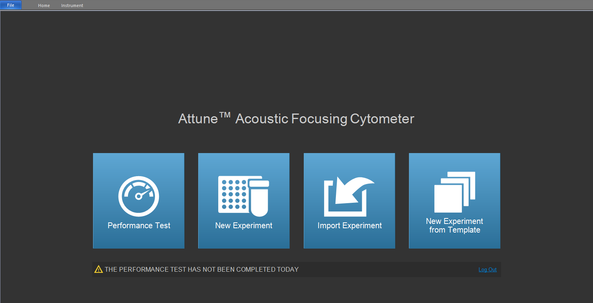
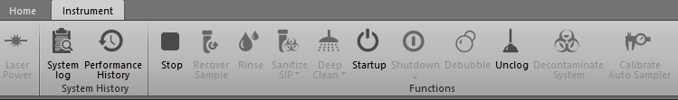
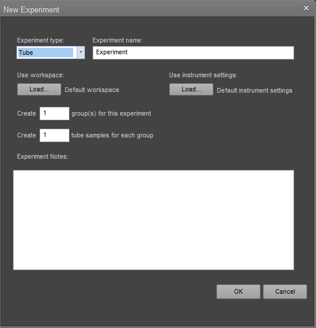
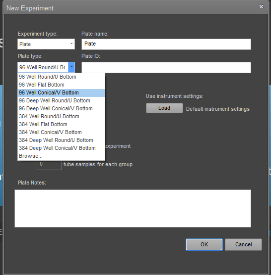
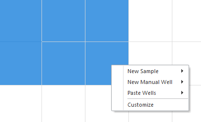
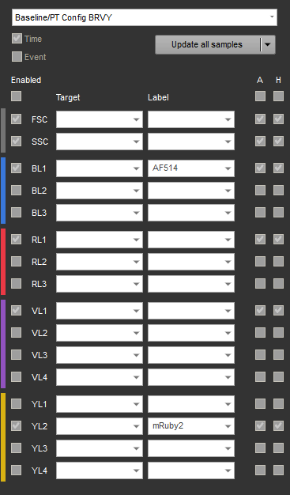
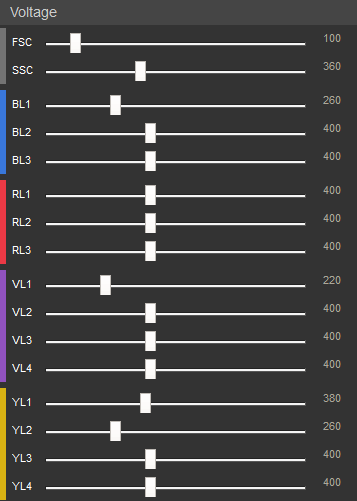
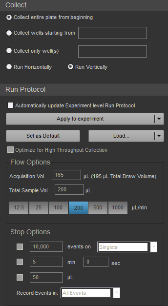
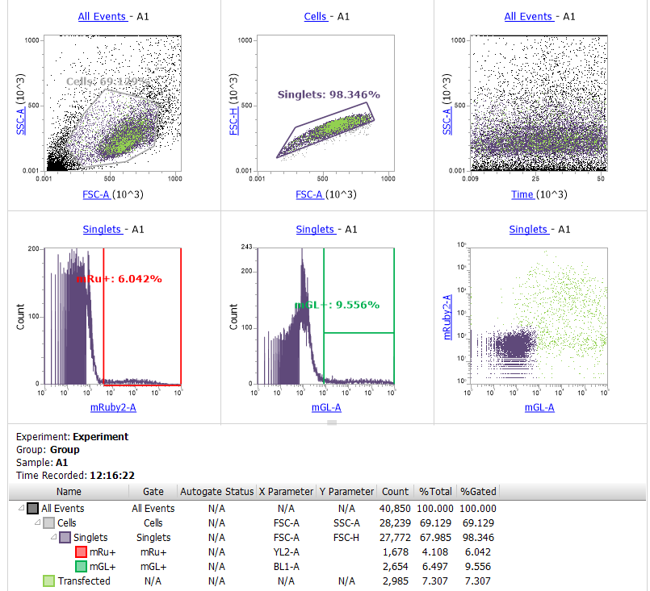
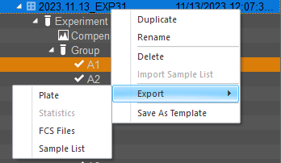

================
Attune software
================

Common processes
__________________

When first logging into the Attune software, you will see the screen below with options to run a performance test, create a new experiment, import an experiment, or create an experiment from a template.
Below these options, the software will display whether or not a performance test has been completed already today.

Clicking on the instrument tab at the top of the window will reveal the options to run various processes as detailed in :doc:`attune_operation`.

Once the startup process is completed, the other processes will be available to run.
To access variations of the processes, such as "Deep Clean - quick" and "Shutdown - thorough" (:doc:`startup_shutdown`), click the dropdown arrow next to the default process name.

Creating an experiment
_______________________

Once you have followed the startup steps and run the performance test (:doc:`startup_shutdown`), you can create a new experiment by clicking the second option on the homepage.
Here, you have the option to create a tube experiment or a plate experiment.
For a tube experiment (below), you only need to specify an experiment name.

For a plate experiment (below), you must specify a plate name/ID as well as the plate type.
Our lab currently uses 96 Well Conical/V Bottom plates, so be sure to update this option to ensure the autosampler functions correctly.

In a plate experiment, you can highlight your desired wells in the Heat Map View, right click, and add the wells to a new sample.
This also gives you the option of designating a manual well, which can be used to test laser settings before running your experiment.

Instrument settings can be accessed using the tabs on the lower left corner of the screen.
In the laser settings tab, you can select which channels to collect using the left checkboxes and add labels to the channels corresponding to your fluorophores.

Below these settings, you can change the voltages of each laser using the slider or type a number in on the right.
Be sure to apply these settings to the experiment after finding the optimal levels.

Finally, the collection settings tab allows you to specify the flow conditions for your experiment.
For a plate experiment, you can choose which of the defined sample wells to run and whether to run horizontally or vertically.
In flow options, you can edit the acquisition volume and sample flow rate.
Finally, in stop options, you can have the data collection stop after a certain number of events, time, or volume.

Customizing the workspace
__________________________

As your experiment runs, your data will be displayed in the experiment workspace.
The workspace tab can be used to customize what information is shown here.
For example, you can create joint plots and histograms for gating as well as show statistics.
The data displayed in each plot can be modified by clicking the words highlighted in blue.
These allow you to change the plot axes and which gated population to plot.

Exporting data
____________________________

To export data from your experiment, right click on the name of your experiment in the right-most panel and select the FCS files to export.

