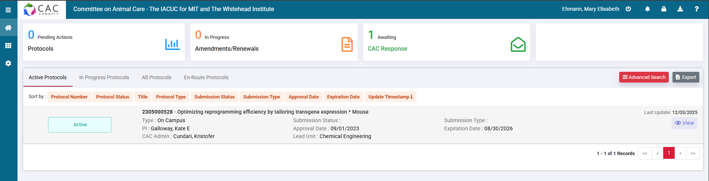
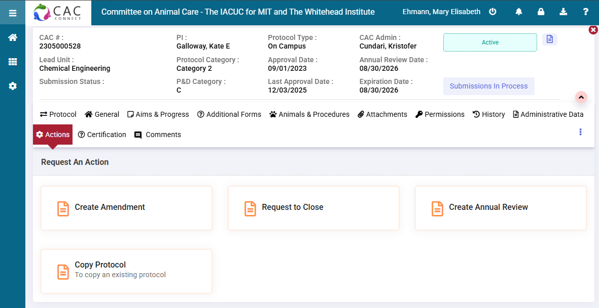
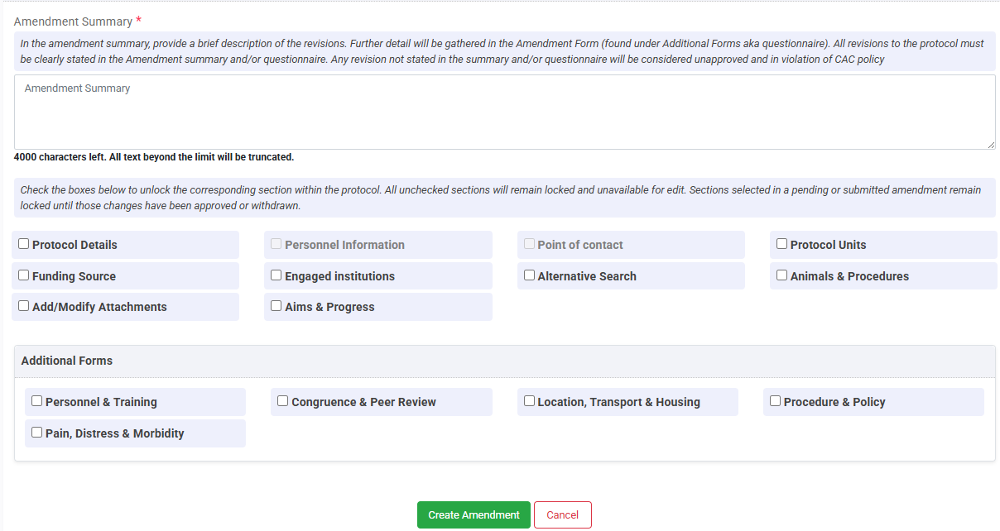
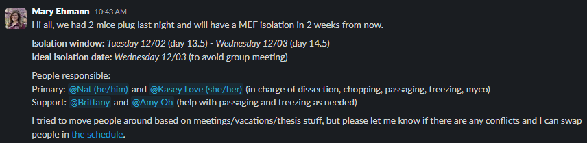

======================
Animal Facility
======================

1. Go to https://atlas.mit.edu and go to the learning center, through the tab on the left.
2. In the upper right, select **My Profile**, then **Join a Group** and select **68N: Mouse**.
3. Complete all the required online trainings/forms that appear for group **68N: Mouse** under the **My Training Needs** tab.

   * General Biosafety for Researchers
   * DCM Facilities Pre-Orientation
   * DCM Cage Cards
   * CITI Working with Mice in Research
   * CITI Working with the IACUC
   * Occupational Health Questionnaire
   * Any others

4. Use the Atlas Learning Center to sign up to attend live training sessions for group **68N: Mouse**. You can register for these sessions by clicking the "Book Session" button. If your schedule absolutely prevents you from attending normally scheduled classes, or if no sessions are listed, email the instructor directly.

   * Rodent Refresher (available once a month, *must be completed once each calendar year*)
   * Animal Handling Orientation: MICE
   * Facility Orientation: 68N

5. Once all the **required** trainings are complete, the current mouse colony manager will need to submit a personnel amendment to the current CAC protocol in CAC-CONNECT.
   All trainings must be completed within 6 months of the amendment being submitted. If trainings are more than 6 months old, you will be required to complete them again.

   * For expired CITI trainings, they need to be manually reset by DCM in Atlas. Email dcmtrainings@mit.edu to do so.

6. To gain access to the facility, you will need to email dcmaccess@mit.edu. In the email include the facility in which you will be working (68N) and your MIT Kerberos ID.
7. Once granted access to the 68N facility, you can be trained on lab-specific CAC protocols.

Mouse Colony Manager Lab Job
==============================

A lab job is to manage our mouse colony. Responsibilities include:

   * Completing annual CAC renewal (or 3 year renewal)
   * Submitting amendments for new mouse strains or protocols
   * Ordering new mouse strains
   * Setting up timed matings with our vet tech Yinghui Ning (yhning@mit.edu)
   * Attending monthly DCM meetings (usually the first Tuesday of each month)
  

How to submit a CAC amendment
-------------------------------

There are multiple types of CAC amendments that you can submit. The most common are personnel and new mouse strain amendments.
Below is the CAC Connect dashboard. Here you can access the active protocol and any amendments that are in progress or submitted to the CAC.

To create an amendment, click "view" on the active protocol. Then produce to Actions >> Create Amendment

After opening an amendment, you will need to first complete the **Amendment Summary** to specify the purpose and type of the amendment. Below is an image what the
summary looks like. 

After filling out this summary, you will need to fill out the follow sections.

For Personnel or Administrative Amendments:

   * Additional Forms: answer all questions marked under an incomplete icon
   * General: change personnel information or points of contact
   * Certification: completed by the PI before the amendment can be submitted

For Animal or Protocol Amendments:

   * Additional Forms: answer all questions marked under an incomplete icon. Include animal justification here if adding a new strain.
   * Animals & Procedures:
  
     * Procedures: If requesting to make a new strain (or purchasing a cryopreserved embryo), include a "Transgenic/KO Animal Production" form
     * Animal Groups: Add new strain to respective mouse groups (usually groups B and C)
     * Animal Justification: A written justification for new strain and number of animals expected in each group per protocol year
     * Certification: completed by the PI before the amendment can be submitted

After completing all required sections, you can submit the amendment by clicking Actions >> Submit Amendment

For more general information, the CAC provides a small online course on how to submit certain `amendments <https://cac.mit.edu/cac-connect/cac-connect-guidance>`_.

Ordering a new mouse strain
-------------------------------

To order new mouse strains, an amendment needs to be added to the CAC protocol and approved. Once approval has been granted
you can proceed with ordering. If ordering from an approved DCM vendor (i.e. Jackson Labs, Charles River, Taconic), email animalrequest@mit.edu. 
For atypical vendors (i.e. MMRRC), these are covered by animal-import-export@mit.edu. They will send you a form that requires you to fill out some standard information:

   * PI name: Kate E. Galloway
   * Department: Chemical Engineering
   * Contact person & email (current mouse manager)
   * Building/Room: 66-219
   * Protocol Title: Optimizing reprogramming efficiency by tailoring transgene expression
   * CAC Protocol Number: 2305000528
   * Campus housing location: 68N

The form will also require information about the strain, vendor, expected pain category, age, and sex of the mice. When ordering both male and female mice, they require separate ordering forms.

.. note:: 
   When ordering throught MMRRC, a COU agreement will need to be filled out. This form will be sent in an email to either DCM or animal-import-export. They will forward this email to you.
   The form (even if they say to fill it out) needs to be sent to Susan Watts in the TLO office (wattss@mit.edu) for them to sign.

Recovering a cryopreserved embryo
----------------------------------

Certain mouse strains are only available for purchase as a cryopreserved embryos. While companies do offer the service to rederive the strain in house, it is usually expensive.
DCM offers assisted reproductive services where they can implant cryopreserved embryos. You must fill out a `form <https://comp-med.mit.edu/form/webform-707>`_ to request the services.
The cost is currently around $300.

Timed matings for embryo isolation
-----------------------------------

In the lab we use mouse embryonic fibroblasts (MEFs) to assess our direct conversion protocols. The MEFs that we use are isolated from embryos at day E13.5 to E14.5. Therefore, we need
to set up timed matings to ensure we isolate embryos on these specific days during gestation. How to set up timed matings:

* Contact our vet tech (Yinghui Ning, yhning@mit.edu) to schedule timed matings. Reach out the week before you want to the matings set up. Provide how many mice you would like to plug (become pregnant) and the pairings you would like. (ex. Hb9+ male w/ WT female)
* Yinghui will send an email regarding how many mice plugged. The day the mice were separated and a plug was found is day E0.5.
* Send a message in the mef_isolation channel with the isolation days (E13.5 or E14.5) and people responsible.
* The day before the isolation, check to see if the mice are pregnant. Send updates in the mef_isolation channel.
* If mice do not appear pregnant, leave the cage and email Yinghui to let her know.

Below is an example of a message in the mef_isolation channel. The schedule can be found `here <https://mitprod.sharepoint.com/:x:/s/GallowayLab/Eaa1DDMFM65IsCM5oHc59DUBvyd7G7xggmkQJ7QRqa_RPg?e=eNfced>`_

