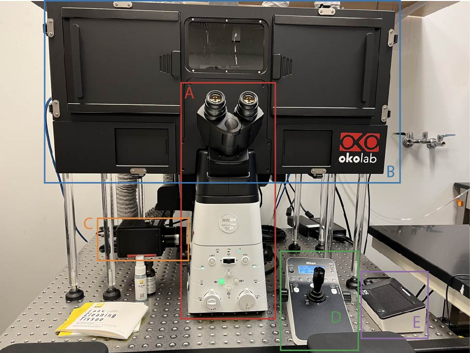
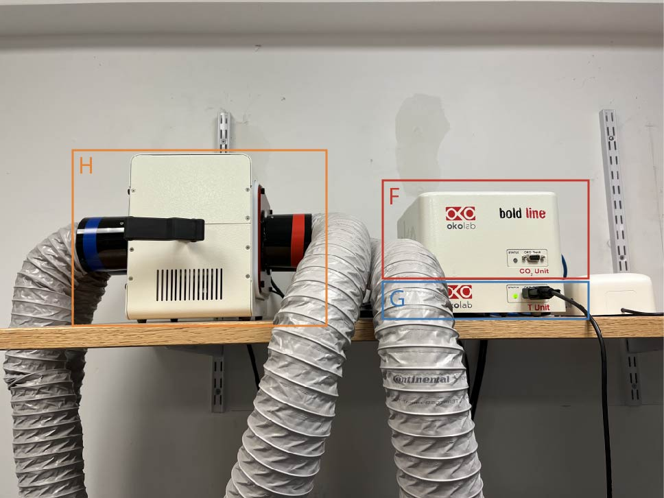
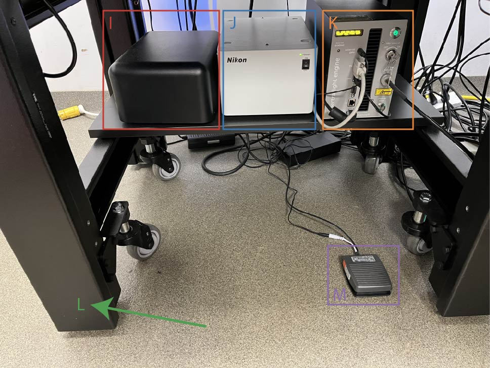

======================
Microscope Components
======================

        A (red): Main body of the microscope, 
        B (blue) Okolab incubation chamber, 
        C (orange): Digital camera, 
        D (green): Joystick/Display, 
        E (purple): Okolab controller display

        F (red): Incubator CO2 unit, 
        G (blue): Incubator temperature unit, 
        H (orange): Incubator heating box

        I (red): Digital camera controller, 
        J (blue): Microscope controller, 
        K (orange): Epifluorescence light source, 
        L (green): Air table (compressor not pictured), 
        M (purple): Incubation chamber light switch