==================================
Simple single image acquisition
==================================

.. important::

  Glass-bottom plates/dishes or glass slides must be used for imaging on the Nikon.
  Plastic plates/dishes may be okay for use with the low power objectives (4x, 10x), but the images will be low quality.

Sample setup
==============
1. Remove the magnetic cover from the front window of the enclosure. 
   Slide open the front left and right doors to facilitate bringing samples inside the enclosure. 
   Slide open the top covers around the microscope to allow the microscope pillar to tilt back. 
   You may use the foot pedal to turn on the light inside the enclosure, but be sure to turn this off when imaging.

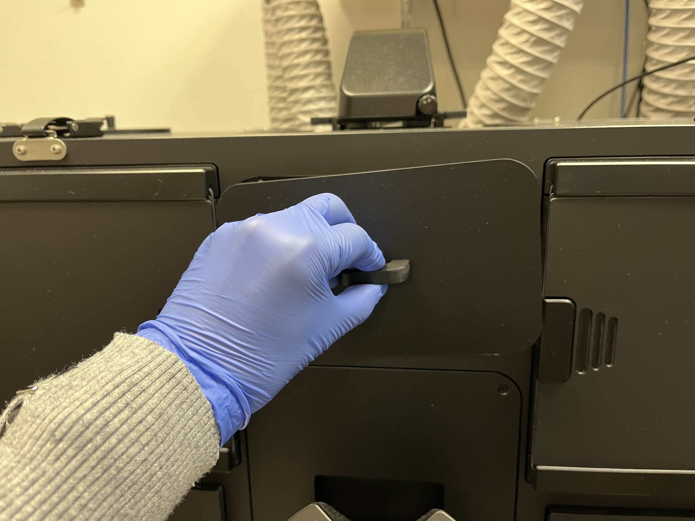

        Removing front magnetic window cover

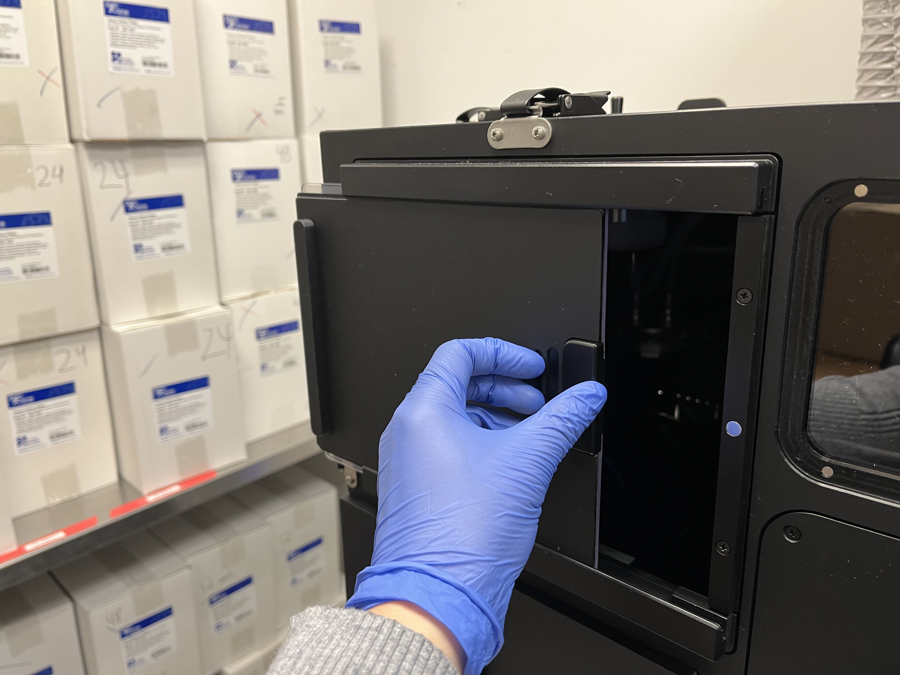

        Sliding open side enclosure door

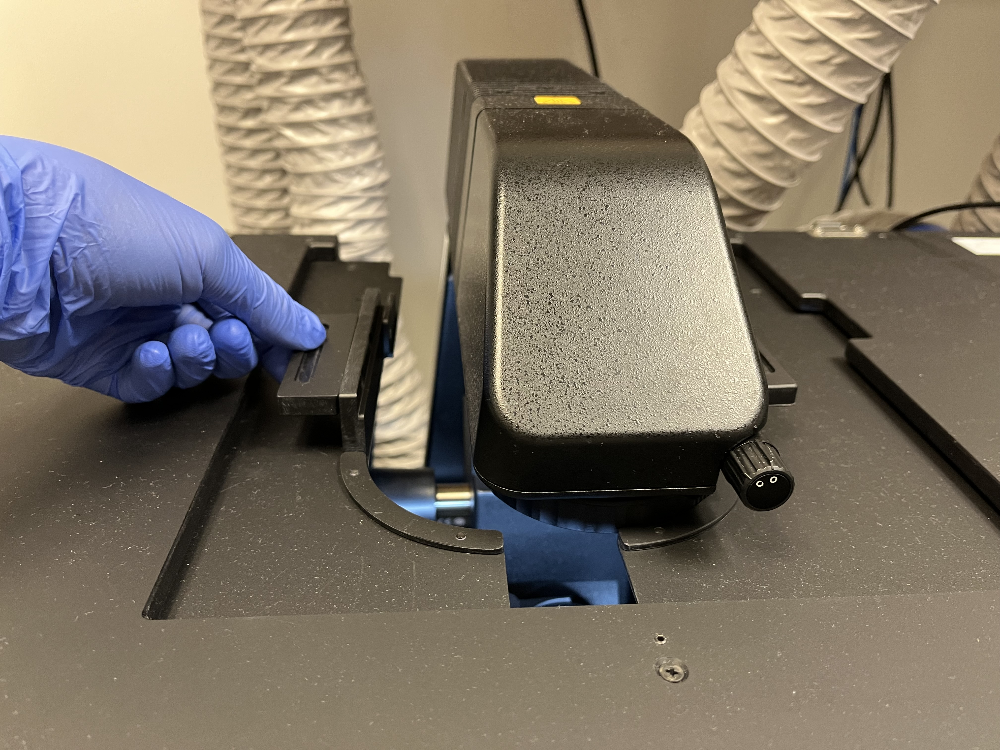

        Sliding open top doors

2. With the microscope pillar down, there is not enough room to safely place your samples on the stage. 
   Carefully, tilt the microscope pillar back to allow for more room.

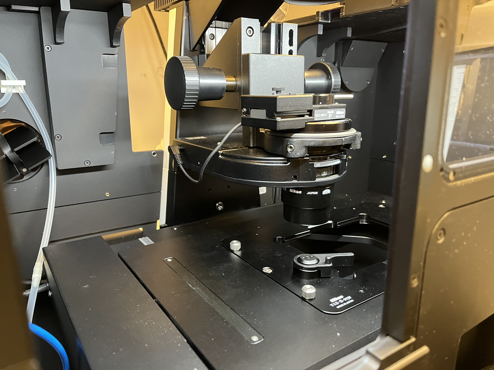

        Microscope pillar in "down" position relative to stage

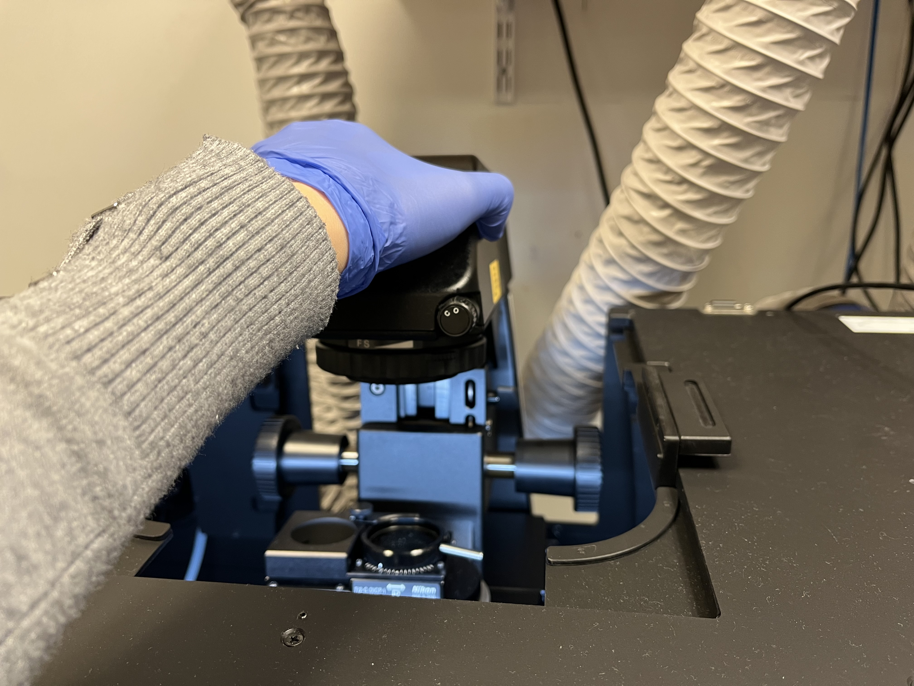

        Tilting microscope pillar up by grasping at the top

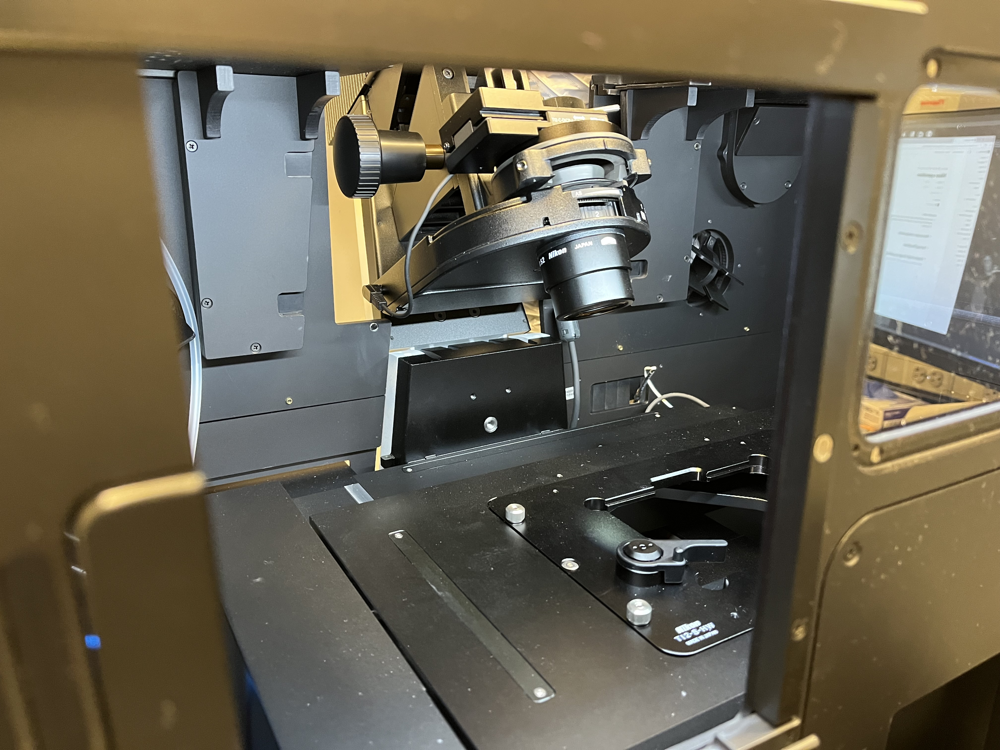

        Microscope pillar in "up" position relative to stage

3. Choose the appropriate plate holder for your sample (TI2-S-HW for well plates and TI2-S-HU for slides and other plates). 
   The Okolabs plate holders should only be used for timelapse imaging. 
   If you must change the plate holder, move the objectives to the lowest z-level by hitting the “ESC” button on the front of the microscope. 
   This prevents the objectives from being damaged. Carefully tighten the six screws (three by hand and three with the labeled Allen wrench). 
   Press the “ESC” button again to return the objectives to their previous position.

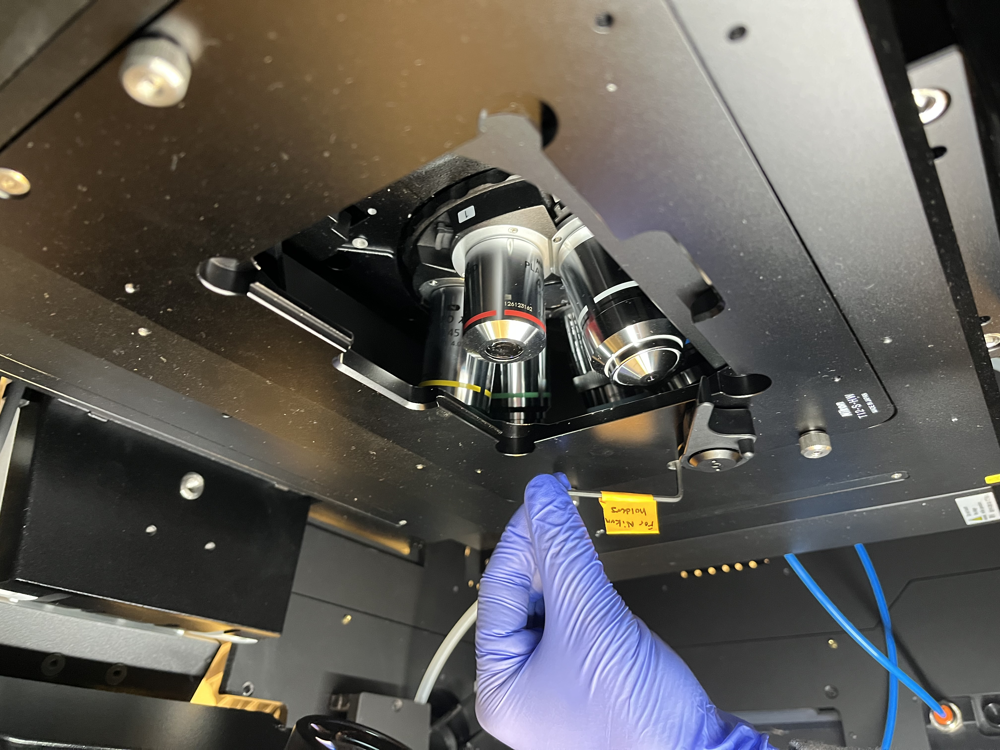

        Using labeled Allen wrench to tighten plate holder

4. If you are using any of the oil immersion objectives (60x, 100x), place a drop of immersion oil on the lens.
5. Carefully place your sample in the holder, making sure to avoid contact with the objectives or the microscope pillar. 
   Tilt the microscope pillar back down into place and close the doors on the front and top of the enclosure. 
   Optionally, place the magnetic cover back on the front window to block out all light.

Basic microscope controls
==========================

1. Find the well plate navigator on the left. 
   Ensure that the correct plate holder is listed on the bottom. 
   If not, click on the gear icon so select the correct one.

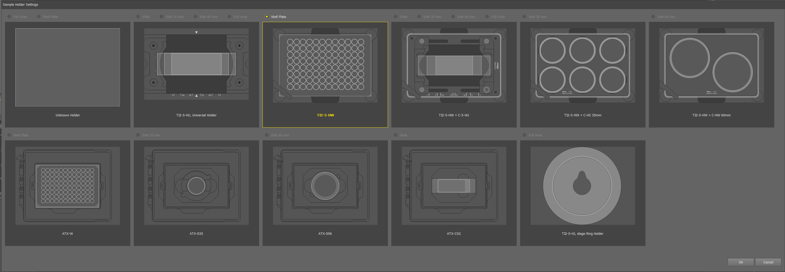

        Options for plate holder

2. Hitting the “Detect” button should automatically detect what kind of well plate you have an update the map. This function has been spotty, but Emma has found it works reliably with an empty plate. When in doubt, the plate icon at the bottom left of the screen can be used to manually switch between well plate maps.

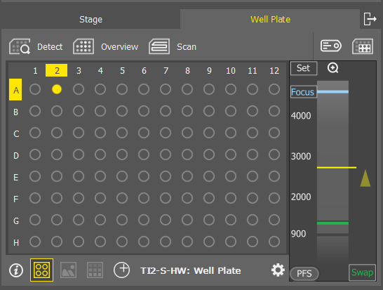

        Well plate map and well plate detection

3. The panel on the right has the controls for optical configuration (which channels are active), exposure times, light intensities, and objectives. 
   To capture a simple image with Brightfield and fluorescence choose “Standard + BF” from the dropdown menu.

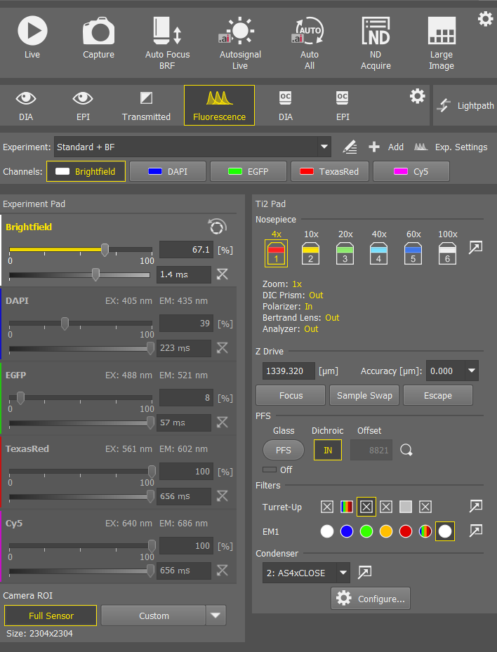

        Optical configuration menu

4. Choose your desired objective by clicking on the icon.

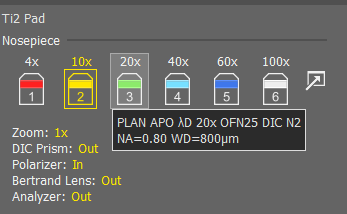

        Objective plate_holder_selection

5. Choose which channels you want on by right clicking on the channel names.

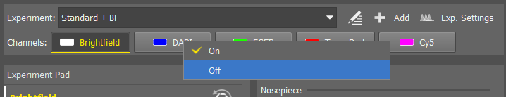

        Fluorescent channel selection

6. Navigate to your desired well either by using the joystick or by double clicking on the plate map. 
   The “XY^” button directly above the joystick determines how coarse or fine the XY movements are. 
    Similarly the “Z^” buttons on the right and left sides determine how coarse or fine the Z movements are. 

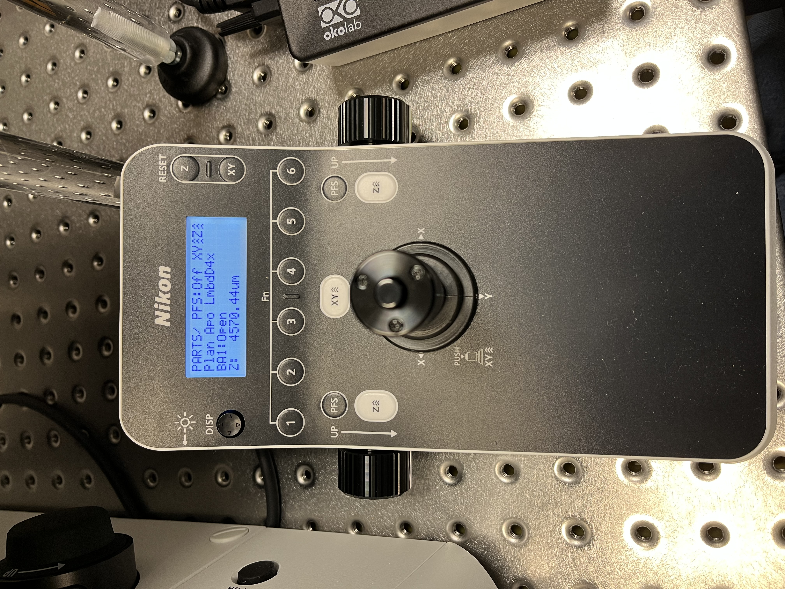

        Joystick controls to move stage

7. Select the Brightfield channel, hit “Live” at the top, and use the focus wheels to find your cells. 
   Be careful not to hit the objective on your plate. 
   Starting at lower objectives and gradually moving to higher magnification can help. 
   Click “Freeze” to pause imaging.
8. Hit “Auto All” to autofocus and autosignal all channels. This works the best with your highest expressing condition. Importantly, this sets the parafocality offsets for each channel, which ensure all your channels are in focus.
   Alternatively, you can select a single channel and individually perform “Auto Focus” or “Autosignal”.
   You can also manually set lightsource power and exposure times for each channel.

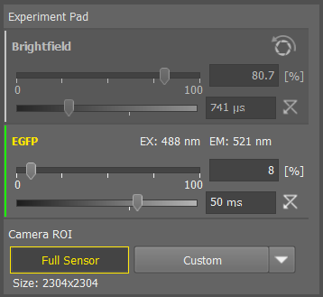

        Optical configuration settings for a sample requiring Brightfield and green fluorescence channels

Simple image acquisition and exporting
========================================
1. Once you are satisfied with the focus and image settings, hit “Capture.” Your image will appear as a new tab in the center workspace. AT THIS POINT THE IMAGE IS NOT SAVED ANYWHERE YET!

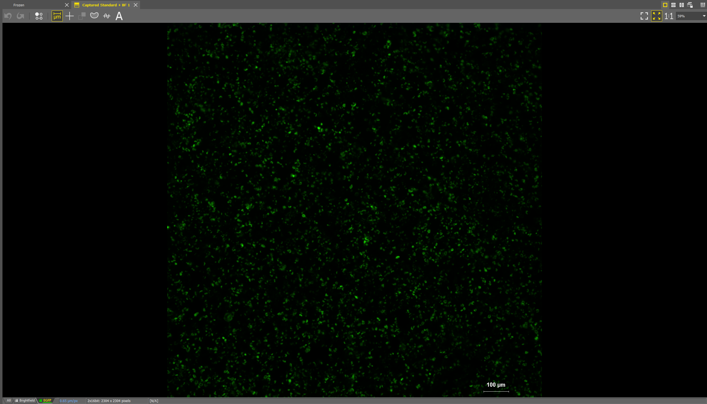

2. You can add a scale bar by clicking on the scale bar icon under the tabs. Right click on the scale bar itself to edit the settings.

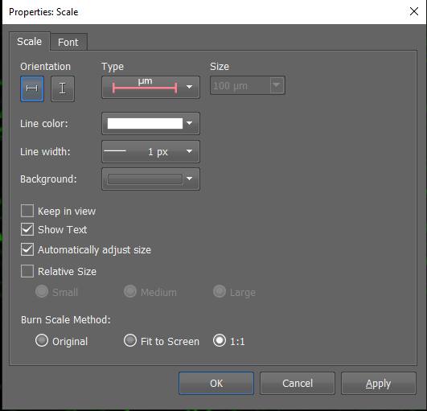

3. Select “Save As…” in the bottom right corner of the screen, and save the image as a .nd2 file. This is format the Nikon software uses for any subsequent analysis and editing.

4. You may also save as a .tif file. This will create a multipage .tif containing the individual channel images. You can additionally save .tif files of individual channels by selecting “RGB Image for Each Channel” and an overlay by “All Channels Merged to RGB Overlay Image.”

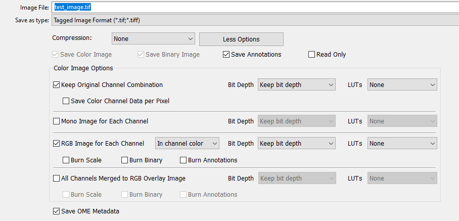

Cleaning up
=============
1. Once you have completed your imaging, open the enclosure doors and tilt the microscope pillar back.
2. Carefully remove your sample.
3. If you used an oil objective, gently clean it with the provided cleaner and wipes. Do not use Kim wipes to clean.
4. Return the microscope pillar to its normal spot and close all doors on the enclosure. 
5. If you are the last user of the day, refer to the instructions for powering the microscope off.