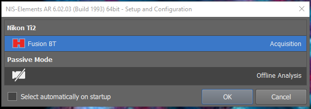

====================
Startup/Shutdown
====================

.. note::

  The microscope controller and epifluorescence light source can remain on all the time, although it may be useful to power cycle them for troubleshooting.
  If they are on, skip their corresponding steps below.

Turning the power on
=====================
1. Turn on the auxiliary devices: digital camera (C) and epifluorescence light source (K)
2. If the controller is not already on, turn on the controller (J).
3. Turn on the main body of the microscope (A). The switch is located at the back corner of the right side.
4. During initialization, the screen on the display (D) should illuminate and display the status.
    1. If initialization fails (screen fails to illuminate, microscope starts beeping, etc.), try power cycling the components above as well as the computer.
    2. If that does not work, turn off all the components and reseat the connections on the back of the microscope controller (J).
5. Open the NIS-Elements software (center of desktop) in acquisition mode. **DO NOT check the box to select automatically on startup.**

Turning the power off (last user of the day)
=============================================
1. Close the NIS-Elements software, making sure to save all of your data.
2. Turn off the the main body of the microscope (A). Check the top, front, and sides of the incubator enclosure to make sure all of the doors are closed.
3. Turn off the digital camera (C).
4. Optional for troubleshooting: Once the lights on the front of the microscope main body turn off, you may turn off the microscope controller (J).

