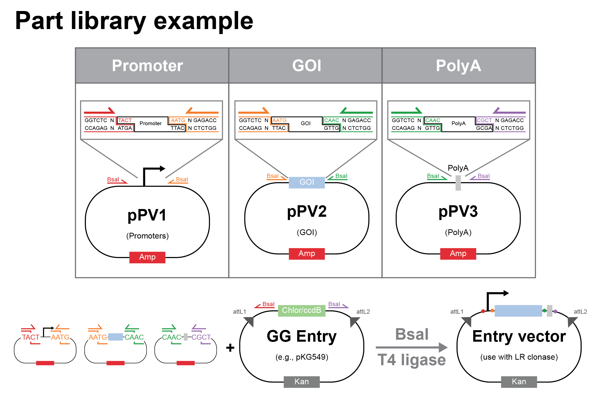
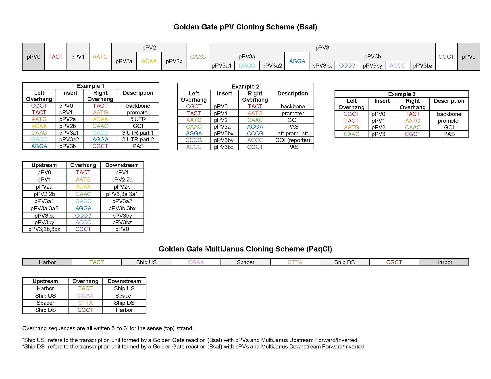
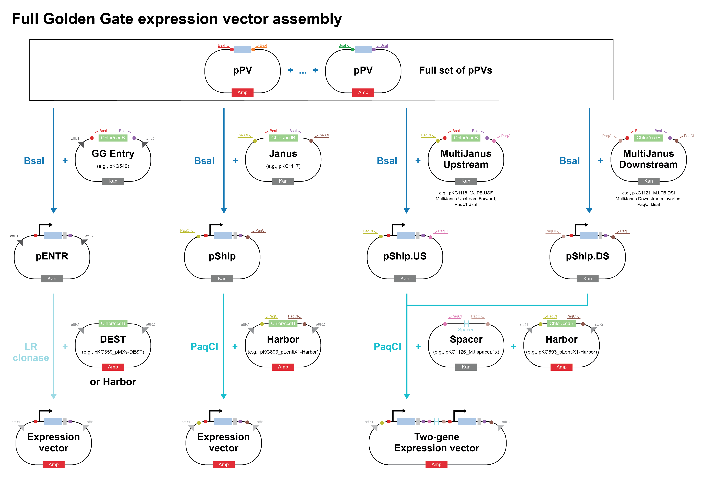

====================
Golden Gate assembly
====================

Golden Gate assembly allows us to create a construct using Type IIS restriction enzymes (REs).
These enzymes can generate custom connector sequences (short single-stranded "sticky ends"), enable scarless assembly, and 
enhance reaction efficiency through multiple rounds of digestion and ligation.

Beyond the general reaction protocol, in lab we have a custom scheme (described :ref:`below <pPV-scheme>`) of connector sequences and library
of plasmid parts that can be modularly combined. This allows for easy, rapid assembly of single and multiple 
transcription units.

Protocol
========
This protocol is derived from the standard NEB protocol (`here <https://www.neb.com/protocols/2018/06/05/golden-gate-24-fragment-assembly-protocol>`__ 
and `here <https://www.neb.com/-/media/nebus/files/manuals/manuale1601.pdf>`__).

1. **Design the assembly.** Use the lab's :ref:`custom Golden Gate scheme <pPV-scheme>`, if possible.
   Otherwise, online tools such as `NEB Golden Gate <https://goldengate.neb.com/>`_ are available for designing primers, choosing connector sequences, etc.

2. **Mix the Golden Gate reaction.** The volumes below are for a 10 µL reaction, but it is possible to scale down to 5 µL for efficient assemblies (e.g., pShips from pPV plasmids).
   If performing many assemblies in parallel, it can be helpful to make a mastermix with buffer, ligase, RE, water, and any shared fragments.

  ================================= =========== ======================================
    Component                       Amount (µL)  Notes
  ================================= =========== ======================================
  75 ng/fragment                     X           
  10X T4 DNA ligase buffer           1
  T4 DNA ligase (400 U/µL)           1.25        500 U, see note below
  Type IIS RE                        0.5         increase to 1 µL if >10 inserts
  Water                              to 10 
  ================================= =========== ======================================

  .. note::
    Make sure to use 500 U of T4 DNA ligase. NEB sells 400 and 2,000 U/µL T4 DNA ligase so scale the volume accordingly.

  .. tip::
    **Gel extract PCR fragments** before using them in Golden Gate assemblies. 
    This removes primers and incomplete fragments, which can interfere with the assembly.
    Alternatively, pre-digest the PCR product with DpnI, rSAP, and the Type IIS RE to be used in the reaction (just spike these in and incubate at 37ºC for 1 hour, like a 
    typical :ref:`DpnI digest <pcr_confirm_purify>`). Then, use a 2:1 molar ratio of insert : backbone in the reaction. Note that reactions using PCR fragments are usually less efficient.
  
  .. tip::
    For plasmid fragments (e.g., pPVs), the reaction often works with 1 µL of each plasmid, 
    as long as the concentration is ~50-150 ng/µL (this simplifies pipetting).

3. **Run the reaction on a thermocycler.** Almost always use the recommended protocol for 2-10 inserts.

  ==================== =============================================================================== ===============
    # Inserts                      Assembly protocol                                                      Estimated time
  ==================== =============================================================================== ===============
    1                   5 min at 37°C (cloning) or 1 hr at 37°C (library preparation) -> 5 min at 60°C   10 min - 1 hr
    2-10                  (1 min at 37°C -> 1 min at 16°C) x 30 -> 5 min at 60°C                           ~1.5 hrs
    11-20                 (5 min at 37°C -> 5 min at 16°C) x 30 -> 5 min at 60°C                           ~5.5 hrs
  ==================== =============================================================================== ===============

4. :doc:`Transform competent cells <transformation>` with 2-5 µL of the Golden Gate mixture. For very inefficient reactions, transform 100 µL of competent cells with the entire 10-µL reaction.
5. Store unused Golden Gate assembly products at -20°C.

For difficult assemblies
========================
When fragments contain internal Type IIS RE cut sites, the Golden Gate assembly reaction will be less efficient.
Ensure that the sticky ends from the internal cut sites are not the same as the connector sequences used in your assembly,
otherwise the reaction will produce incorrect products. 
Assemblies with one internal cut site will typically work, particularly with the modification below.

On the other hand, **assemblies with multiple internal cut sites are likely to fail**. Look for a domesticated sequence
(often labeled ".d" in the plasmid database) to use instead, or domesticate it yourself by mutating a base in the RE recognition site. 
Choose a synonymous codon to maintain the same amino acid sequence (if applicable). In general, it is worth domesticating 
sequences that you will use more than once in cloning (almost everything).

Assembly protocol with additional ligation
******************************************

1. Mix a 10-µL assembly reaction as described above (step 2).
2. Run the reaction with the modified thermocycler protocol below. Note that increasing the number of cycles likely will *not* improve efficiency.

  +----------------------+------------------+-----------+
  | Step                 | Temperature (ºC) | Time      |
  +======================+==================+===========+
  || 1. Digestion        || 37              || 1 min    |
  || 2. Ligation         || 16              || 1 min    |
  || x 30 cycles         ||                 ||          |
  +----------------------+------------------+-----------+
  | Additional ligation  | 16               | 1 hr      |
  +----------------------+------------------+-----------+
  | Enzyme inactivation  | 80               | 20 min    |
  +----------------------+------------------+-----------+

3. Store assemblies at 4ºC until proceeding to the next step. (Or, cool to 4ºC for ~5 min and leave at room temp short-term.)
4. Spike in additional 10X T4 DNA ligase buffer and T4 ligase.

  ================================= ===========
    Component                       Amount (µL) 
  ================================= ===========
  Assembly mix                       10           
  10X T4 DNA ligase buffer           1.25
  T4 DNA ligase (400 U/µL)           1.25      
  **Total**                          **12.5**
  ================================= ===========

5. Ligate for 1 hour at 16ºC or overnight at room temperature.
6. :doc:`Transform <transformation>` 100 µL of competent cells with 10 µL of the final assembly. 
   To further increase efficiency, incubate the transformation on ice for 1 hour instead of 10 minutes.

.. _pPV-scheme:

In-house Golden Gate assembly scheme
====================================

In lab, we use a custom, hierarchical Golden Gate assembly scheme to modularly swap parts in single- 
and multi-transcription unit vectors. This is analogous to other MoClo (modular cloning) schemes.

Level 0: pPV
************

First, we create a library of **"part vector" plasmids (pPVs)** encoding individual genetic parts, such as 
promoters, coding sequences, and polyadenylation signals. Often, we use Gibson assembly to generate the pPVs, 
but other assembly methods (including Golden Gate, just not with this scheme) also work. pPV plasmids are equivalent to "Level 0" plasmids 
in other MoClo schemes. These vectors have **ampicillin resistance**. The important point here is that 
this library of parts is reusable! We only need to create each pPV once, then it can be used in many downstream 
assembly reactions.

Level 1: pShip
**************

Next, we use the pPVs to assemble **single transcription units (TUs)** using a Golden Gate reaction with **BsaI**.
The resulting plasmids are **pShip** plasmids, which contain **kanamycin resistance**. These are equivalent to "Level 1" plasmids in other MoClo schemes.

This assembly requires at least 4 plasmids:

  1. pPV1: promoter
  2. pPV2: coding sequence aka gene of interest (GOI)
  3. pPV3: polyadenylation signal
  4. The vector backbone

The vector backbone (aka pPV0) includes plasmid backbone components like the origin of replication and antibiotic 
resistance cassette. It also includes sequences that flank the pPV inserts for downstream cloning steps. Note that 
this assembly reaction removes a cassette containing chloramphenicol resistance and the ccdB protein from the original pPV0 vector.
This reduces background colonies containing the uncut vector backbone plasmid. 

The vector backbones we use are usually one of the following:

  - **pKG0549:** GG Entry vector, flanks pPV inserts with both PaqCI sites for downstream Golden Gate reactions and attL sites for Gateway assembly
  - **pKG1117:** Janus, flanks pPV inserts with PaqCI sites such that the resulting pShip can be used to generate a single-TU expression vector
  - **pKG1118-21:** Multi Janus, flanks pPV inserts with PaqCI sites such that the resulting pShip can be included in a multi-TU expression vector

Additionally, each pPV plasmid can be replaced by multiple plasmids, where the first contains the left pPV connector sequence, the last contains the right
pPV connector sequence, and the middle connector sequences are complementary. For example, you can use both a pPV3a plasmid and a pPV3b plasmid in place of 
a pPV3 plasmid. See the list of connector sequences below.

Level 2: Expression vector
**************************

Finally, single or multiple transcription units can be combined into an **expression vector** using a Golden Gate reaction with **PaqCI**.
The final plasmid contains additional sequences necessary for downstream delivery to mammalian cells. 
This includes ITRs for PiggyBac integration, LTRs and other sequences for virus production, or selection cassettes for landing pad integration.
The resulting plasmids have **ampicillin resistance** and are equivalent to "Level 2" plasmids in other MoClo schemes.

Single TU assemblies require only two plasmids:

  1. pShip (from pKG0549 GG Entry or pKG1117 Janus backbone)
  2. Harbor plasmid: the vector backbone containing appropriate PaqCI sites and connector sequences

Multi-TU assemblies require 4 plasmids:

  1. pShip.USF or pShip.USI: upstream TU in forward or inverted orientation
  2. Spacer plasmid: intergenic sequence between the TUs
  3. pShip.DSF or pShip.DSI: downstream TU in forward or inverted orientation
  4. Harbor plasmid: the vector backbone containing appropriate PaqCI sites and connector sequences

The **Harbor plasmids** are conceptually similar to the Janus and Multi Janus vectors. They include plasmid backbone components and a chloramphenicol and
ccdB cassette that is removed during assembly to reduce background. Additionally, they contain the relevant auxiliary sequences for downstream delivery
to mammalian cells.

Common Harbor plasmids include the following:

   - **pKG0893:** pLentiX1-Harbor, 3rd-generation lentiviral vector backbone
   - **pKG4859:** pPB-Harbor, for PiggyBac integration with the (corrected) long ITRs
   - **pKG3560:** Rogi2 landing pad Harbor, for integrating at the Bxb1-GT recombination site
   - **pKG2765:** STRAIGHT-IN Harbor, for integrating at the Bxb1-GT landing pad (EF1a promoter trap, excise with Cre)
   - **pKG2812:** STRAIGHT-IN Harbor, for integrating at the Bxb1-GA landing pad (EF1a promoter trap, excise with Flp)

The resulting expression vector is usually named based on the final vector backbone, e.g., pLentiX1 or pPB.

List of connector sequences
***************************

Schematic of entire Golden Gate workflow
*****************************************

