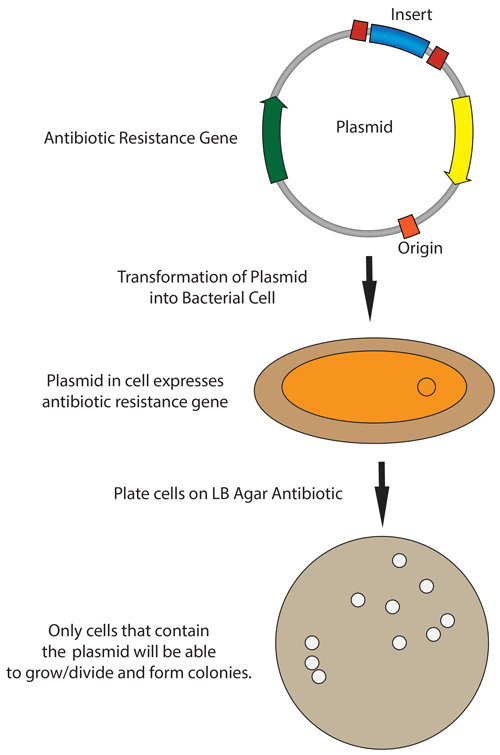

========================
Bacterial transformation
========================

Cloning summary
===============
In molecular cloning, we transform DNA of interest into
competent bacterial cells. There are several different competence
methods that require different transformation methods. After transformation,
bacteria that have incorporated the DNA of interest are selected for using
various antibiotics.

|

Transformation of chemically competent bacteria
=========================================================
.. time::
	30 minutes (no outgrowth) or 90 minutes (with 1 hour outgrowth)

1. Thaw chemically competent cells from the -80°C (Elsa) on ice, approximately 10 minutes.
2. Take out an agar plate with the appropriate antibiotic from the 4°C deli fridge and let warm up to room temperature. 
   Optionally, warm to 37°C in the incubator. 
3. Mix 1-5 µL of DNA (usually 10 pg -- 100 ng) or assembly product into 20-50 µL of competent cells in a 1.7-mL tube.
   Generally, use NEB Stable cells unless your plasmid product contains ccdB. GENTLY mix by flicking the bottom of the tube with your finger a few times.

   .. important::
		Ensure that the total volume of transformed DNA or reaction mixture does not exceed more than 10% of the total volume (i.e., for 50 µL of competent cells, don't use more than 5 µL of DNA or reaction mixture).
		
   .. note::
		Typically, 2-5 µL assembly reaction mixed with 20-50 µL of competent cells generates sufficient colonies.
		For lower efficiency reactions, use the higher end of this range or more.
		Transformation efficiencies will be approximately 10-fold lower for assemblies than for an intact control plasmid.

4. Incubate the cell/DNA mixture on ice for 10 min.

   .. tip::
	To increase transformation efficiency, you can incubate on ice for 1 hour or more.

5. (*Optional*) Heat shock the mixture by placing the bottom 1/2 to 2/3 of the tube into a 42°C water bath for 30-60 sec 
   (45 sec is usually ideal, but this varies by the type of competent cells). Place the tubes back on ice for 2 min.

   .. note::
		With the competent cells used in our lab, a heat shock step is not required but may increase transformation efficiency,
		especially with ccdB/Chlor selection or low efficiency assemblies.

6. To outgrow the bacteria, add 10x volume of LB or SOC media (without antibiotic) to the mixture (e.g., for 30 µL of DNA/cells, add 300 µL SOC).
   Shake at 37°C for 1 hour.

   .. note::
		This outgrowth step allows the bacteria time to express the antibiotic resistance proteins encoded on the plasmid backbone so that they will be able to grow once plated on the antibiotic-containing agar plate.
		This step is not necessary for Ampicillin resistance but is important for other antibiotic resistances (Kan, Chlor). If skipping the outgrowth step, 300 µL of Elga water can be added to help spread the cell mixture.

7. Spread the transformation mixture onto the pre-warmed agar plate.

   **Spread with beads:** Before adding the transformation mixture, shake ~20 sterile glass beads onto the agar plate. 
   Add the transformation mixture to the plate and gently shake in a lateral motion (shaking in a circular motion will only spread around the plate edges). 
   Collect used glass beads in the designated, bleach-containing box for disinfection and reuse.

   **Spread with a pipette:** Using a P1000 pipette, add the transformation mixture to the plate. Holding the pipette as parallel
   as possible to the plate, gently spread the liquid across the surface. Avoid scratching the agar. This is useful for plating multiple transformations on a single 
   plate—just make sure the liquid from separate transformations don't touch.

   .. note::
		If the culture volume is too big, gently collect the cells by centrifugation for 5 minutes at ~200xg and resuspend in a smaller volume of LB or water.
		If the agar plate doesn't dry adequately before the cells begin dividing, the bacteria will diffuse through the liquid and won't grow in colonies.

8.  Incubate plates overnight at 30ºC (to reduce mutation/recombination, important for viral plasmids or those with repeats) or at 37°C (for faster growth). 

.. tip::
	For most cloning strategies, 2-5 µL of the reaction mixture is sufficient to add. Ligation reactions are less efficient and may require larger volumes. 
	Usually, using 30 µL of competent cells and 300 µL of SOC media (or Elga water if plating with Ampicillin) yields a sufficient number of bacterial colonies.

