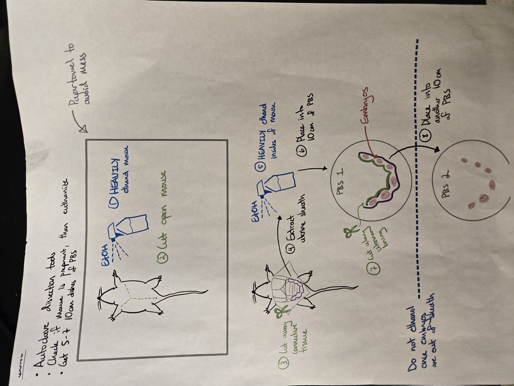
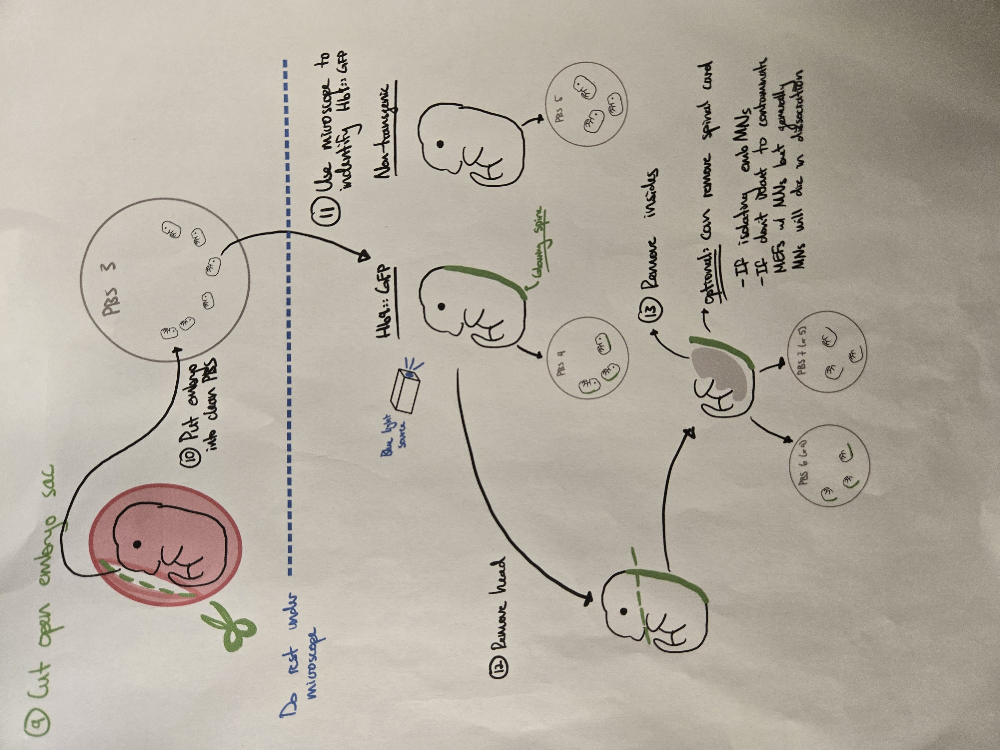
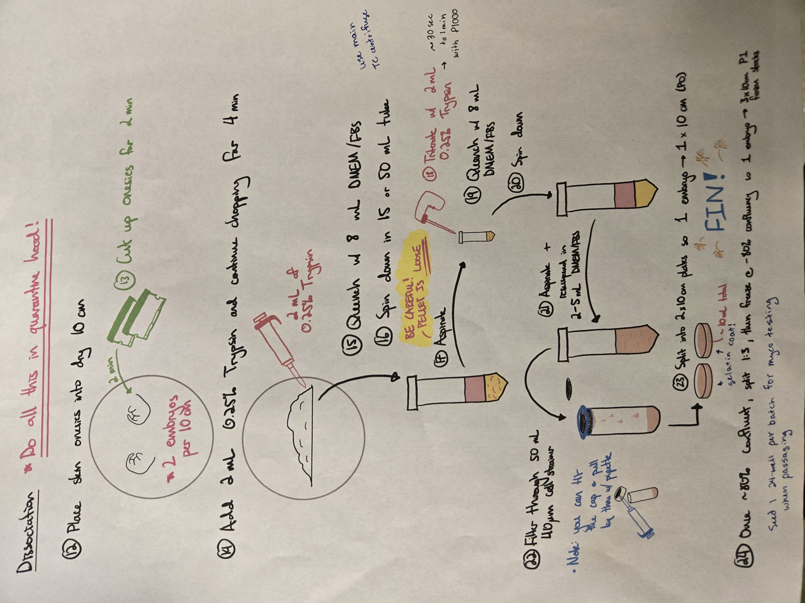

=======================
MEF Isolation Protocol
=======================

In reprogramming, we use transgenic mouse reporter lines to easily assess reprogramming yield and efficiency. We have many transgenic lines in house (Hb9::GFP, Oct4::GFP, CX3CR1::GFP, p53-/-)
that we use for reprogramming purposes. From these lines we mainly isolate mouse embryonic fibroblasts on day E13.5 to E14.5. The mouse colony manager sets up timed matings as we need and assigns
people to take charge of the isolation and other downstream needs.

Isolation protocol
===================

The isolation and embryo processing is done by the two primary people on the MEF isolation. They may also help out with the passaging, freezing and myco testing as needed.

.. note::

    You must have access to the mouse facility in 68N to retrieve the mice. You should also be trained by a senior lab member of how to properly euthanize the mice and transport them back to the lab.

Retrieving the mice
--------------------

1. Head to the mouse facility with the mouse transport styrofoam (68N sub-basement) and grab all timed mating cages in room 68-050
2. Bring cages to the surgery room and euthanize mice with carbon dioxide and an appropriate secondary method
3. Place carcasses into a small clear plastic bag, then into a larger black bag, and finally into the transport styrofoam
4. Place used cages onto carts outside of the washing station. Remove cage cards and bring them back to the lab with the mice.

Embryo isolation
-----------------

Proceed with all steps in quarantine (66-219) and use autoclaved surgery tools from the metal case. Prepare 10 cm dishes with some sterile PBS in them (usually 3 per mouse).

1. Remove mice from the bag and place onto paper towels
2. Heavily spray mice with 70% ethanol and make a "Y" cut along the abdomen. Be careful not to cut the intestines
3. If the mouse is pregnant, pull the uterus with the embryos forward. Heavily ethanol the mouse again.
4. Carefully cut away the uterus from the mouse and place it into a 10 cm dish with PBS. 
5. Once the uterus is removed, place the mouse back into the clear plastic bag.
6. Carefully cut the embryos out of the uterine lining. The embryos will still be incased in a smaller sac once removed from the lining. Place them in a separate 10 cm dish.
7. Using scissors or sharper tweezers, remove the final lining around the embryos. 
8. If isolating Hb9::GFP embryos, use the blue laser and plastic shield to identify GFP+ embryos. Place the embryos (based on transgenic/NT) into separate 10 cm dishes.
9. Place the dish with the embryos under the dissection microscope. Using 2 pairs of tweezers, carefully remove the head of the embryo and remove all the red insides, leaving behind a "skin suit".
10. Place 2 "skin suits" in one 10 cm dish (with NO PBS) and proceed to downstream processing steps in the hood.

.. note::
    You will need to return the carcasses to the mouse facility and place them in the freezer in the surgery room. Ensure that all carcasses are double bagged and one bag labeled with PI last name.

Embryo processing
-----------------

Complete all steps in the BSC in quarantine (66-219) and with separate quarantine materials. You may use the centrifuge in TC for spin steps.

.. note:: 
    You will plate 1 embryo per 10 cm dish at the end of processing. The plates MUST be gelatin coated otherwise the MEFs will die. Coat the required number of 10 cm dishes before processing.

1. Coat the required number of 10 cm dishes (one 10 cm dish per embryo)
2. Place the 10 cm dish with 2 embryos into the quarantine hood. Using 2 new razor blades, chop the embryo for 2 minutes.
3. After 2 minutes, add 2 mL of 0.25% Trypsin per 10 cm dish. Chop for an additional 4 minutes.
4. Add 8 mL of DMEM + 10% FBS to each dish. Transfer dish contents to a 15 mL conical.
5. Spin the conical down for 5 minutes at 300-400 g.
6. VERY carefully aspirate the supernatant 
   
.. note::
    The pellet will be VERY loose. It is important that you are very careful with your aspiration steps otherwise the pellet will be lost. It is ok to leave a little media on top of the pellet to avoid accidentally aspirating it.

7. Resuspend the pellet in 2 mL of 0.25% Trypsin
8. Quench with 8 mL of DMEM + 10% FBS.
9. Spin down for 5 minutes at 300-400 g, aspirate the supernatant and resuspend in 2-5 mL of DMEM + 10% FBS.
10. Place a 40 um strainer over a 50 mL conical. Strain the cell mixture through, using a sterile pestle to help push some of the cells through
11. Wash the strainer using DMEM + 10% FBS. You may find it useful to pull liquid through the opposite side of the strainer with a P1000
12. Spin down the strained mixture for 5 minutes at 300-400 g. 
13. Aspirate supernatant and resuspend the pellet to plate onto 10 cm dishes (~10 mL volume per 10 cm dish)

.. note::
    Be sure to label plates depending on which embryos were chopped together (i.e. for each # you will have 2 dishes)

Maintenance, freezing and testing protocols
-------------------------------------

The passaging, freezing and myco testing as usually done by the two secondary people on the isolation. This is to help reduce the amount of time one person spends in the hood per isolation.
The primary people may also help with these tasks as needed.

Passaging MEFs
---------------

MEFs will need to passaged once they reach ~80% confluency (about 3-4 days). Depending on the isolation, certain plates may be ready to passage earlier or later than others.

1. Gelatin coat the required number of 10 cm dishes (three 10 cm dishes per one original 10 cm dish) AND a 24-well plate for myco testing
2. Aspirate media from dishes
3. Wash plates once with sterile PBS
4. Aspirate PBS and add 3 mL of a dilute mixture of PBS and 0.25% Trypsin (either 1:2 or 1:3 works well)
5. Wait 5-8 minutes for cells to start lifting off of the plate. Quench with 3 mL of DMEM + 10% FBS.

.. note::
    When passaging you may combine cells that were chopped together to use less tubes

6. Transfer cells to a 15 mL or 50 mL conical and spin down for 5 minutes at 300-400 g
7. Aspirate supernatant and resuspend pellet in DMEM + 10% FBS
8. Before plating cells on 10 cm dishes, take a small amount of the cell suspension and transfer it to a 24-well for myco testing. Make sure there is at least 0.7 mL of media in the well.
9. Distribute one embryo to three 10 cm plates

Freezing MEFs
--------------

MEFs will need to be frozen once they reach ~80% confluency (about 3-4 days since passage). Be sure to print labels for the cryovials before proceeding.

1. Aspirate media from dishes
2. Wash plates once with sterile PBS
3. Aspirate PBS and add 3 mL of a dilute mixture of PBS and 0.25% Trypsin (either 1:2 or 1:3 works well)
4. Wait 5-8 minutes for cells to start lifting off of the plate. Quench with 3 mL of DMEM + 10% FBS.
5. Transfer cells to a 15 mL or 50 mL conical and spin down for 5 minutes at 300-400 g
6. Aspirate supernatant and resuspend pellet in freezing media (10% DMSO + 90% FBS). Resuspend such that each 10 cm plate pellet is about ~1 mL of volume.
7. Distribute cell mixture to the respective labeled cryovial
8. Place cryovials in freezing styrofoams in the -80C
9. The next day, transfer cryovials to the liquid nitrogen in the box labeled "Waiting for myco"

Myco testing MEFs
--------------------

Myco testing for the MEFs is done according to this procedure. Always add additional media (more than 0.5 mL) back onto the cells in case they need to be retested. 

**If MEFs come back negative:**

1. Negative is defined as a score less than 1
2. Move cyrovials from the "Waiting for myco" box to the correct boxes in the small liquid nitrogen tank
3. Write tube names, initials, and date from the tubes on the MEF stock tracker along with the number of vials added
4. Discard the myco plate

**If MEFs come back borderline:**

1. Borderline is defined as a score between 1 and 1.2
2. Re-test for myco the next week.
3. If still borderline, bleach vials and discard the myco plate

**If MEFs come back positive:**

1. Positive is defined as a score above 1.2
2. Bleach all vials and discard the myco plate.
   
.. note::
    Myco testing at the Koch is relatively expensive ($70 per sample), so we usually only test the MEFs once or twice. We should soon be able to do our own myco testing in lab for $10 per sample