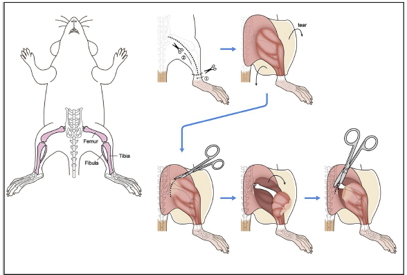
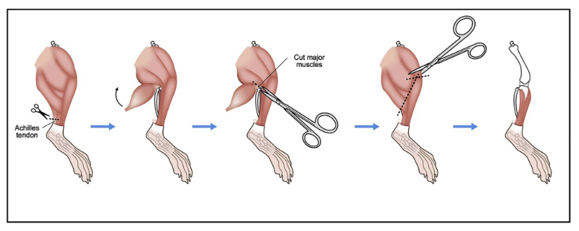
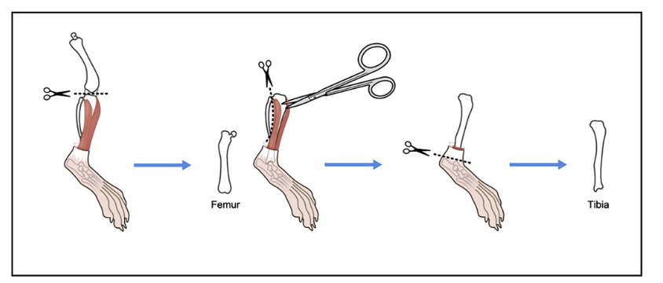
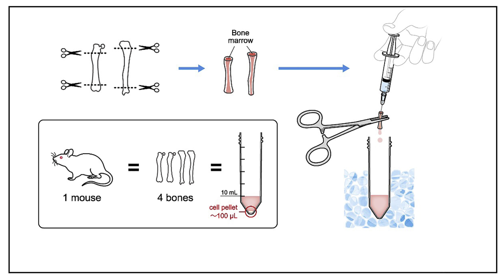

Murine Bone Marrow Isolation
============================

This protocol details the isolation of bone marrow from mice along with culturing techniques for bone marrow derived macrophages (BMDMs).

The BMDM differentiation protocol takes 7 days before the cells are fully differentiated into macrophages and can be used for downstream experiments. Make sure to take this into account before planning out experiments.

**Materials/Reagents**
----------------------

The dissection is by far the most time consuming part of this isolation. Below are materials that you will need:

==================== ====================
Dissection Materials Isolation/Culturing
==================== ====================
Surgical scissors    DMEM + 10% FBS
Tweezers             MCSF1
Scalpels             Pen/Strep
10 mL syringes       40 um cell strainer
25 gauge needles     Pestle
==================== ====================

**Protocol - Dissection**
--------------------------

.. time::

  30 minutes per mouse

1. Sacrifice the mouse and bring it back to 66-219, place down paper towels or pads from the mouse facility and lay out the mouse.
2. Heavily spray the outside of the mouse with 70% ethanol. If a MEF isolation is occurring, allow the embyros to be isolated before moving on to the bone marrow.
3. Cut away the skin from the two hind legs of the mouse. Begin to cut back the muscle with scissors to expose the femur-pelvic joint. See below for image examples.
4. Cut away as much muscle and skin as possible from the hind legs before cutting through the femur-pelvic joint.
  
.. note::
    
    It is important that you be very careful when removing the muscle. Mouse bones are very easy to cut with the scissors.

5. Once the legs have been removed from the mouse, return the mouse to the carcass bag.
6. Remove any remaining muscle with the scalpel, being careful to not cut yourself.
7. Once the majority of the muscle has been removed from the bone, place the bones in a petri dish with 1x PBS.

.. note::
    
    If you will not be harvesting the bone marrow for more than 30 minutes, place the petri dish on ice.

8. Before moving into the hood, try to remove any last bits of muscle that were loosened up with the PBS soak.

Bone Isolation with Images
==========================

**Protocol - Isolation & Processing**
-------------------------------------

.. time::
    1 hour

1. Bring the petri dish with the bones, tweezers and scissors into the hood
2. You will need to cut off the ends of the femur and tibia to create ends for the bone marrow be washed out of the bones.
    
    - Pick up the bones using the tweezers and carefully cut just the end of each of the bones.

.. note:: 

    Be careful when cutting the ends of the bones. Try not to cut too much of the bone and beware of the small bits one bone flying

3. Prepare a 50 mL conical and an aliquot of 1x PBS. The bone marrow will be flushed into this conical.
4. Place the needle onto the end of the syringe and take up 2-3 mL of PBS
5. Pick up the bone with the tweezers and insert the needle into the center of the bone. You should be able to feel a hollow area inside of the bone. Hold the bone over the conical, slowly flush PBS through the bone.
   
.. note:: 
    
    When the bone marrow is flushed from the bone, you should see a red clump expel into the tube. The bone should appear clear/transluscent at this point.

    Do NOT flush the PBS too quickly through the bone. It is possible that the PBS will backflow and this will cause liquid to spray outside of the conical.

6. Repeat with the remaining bones.
7. Spin down the cells for 5 mins at 1600g.
8. Aspirate off the PBS and resuspend the cells in DMEM + 10% FBS
9.  Place a strainer on another clean 50 mL conical and ready a pestle
10.  Prime the strainer with 1 mL of DMEM + 10% FBS and then pass through the resuspended bone marrow
11.  Use the pestle to mash the cell suspension through the strainer and wash it through with DMEM + 10% FBS
    
.. note::
    
    At this point you can also use a clean pipette tip to pull liquid through the bottom of the strainer if it is clogged
  
12.   If you have a large volume of media, you can spin down the cells for 5 mins at 1600g and resuspend in a smaller volume.
    - If you spun down the cell suspension, aspirate off the media and resuspend into a smaller volume
13.  Seed cells into desired plate for downstream experiments. If your desired cell type is BMDMs, culture in DMEM + 10% FBS with 1x Pen/Strep and 10 ng/mL M-CSF.

.. note::

    If you plan to use the cells in TC, be sure to seed a plate of cells for myco testing.

**Culturing Tips**
------------------

Differentiation of bone marrow cells into bone marrow derived macrophages takes 7 days. Bone marrow cells should be cultured in macrophage colony stimulating factor 1 (MCSF1) at a concentration ranging from 1-50 ng/mL. Currently, 10 ng/mL has achieved acceptable yield and purity of BMDMs.

.. time::

    7 days

===================== ===============
Differentiation Media Concentration
===================== ===============
DMEM + 10% FBS         N/A
Pen/Strep              1 ng/mL
MCSF1                  1-50 ng/mL
===================== ===============

.. note::

    MCSF1 aliquots can be found in the -20C TC freezer in the "Microglia Small Molecules" box. Aliquots are at a concentration of 10 kx (i.e. for 10 mL of media, add 10 uL of MCSF1 to achieve 10 ng/mL)

1. Seed cells in differentiation media.

.. note::

    If you are planning to remove the cells from the current plate, be sure to seed them on un-treated plates. These plates are labeled in 66-219. BMDMs are very sticky once fully differentiated and seeding on gelatin coated plates or treated plate will make removal very difficult. 

    If your experiment is terminal in the current plate, the plate type and coating is less important even though it could impact the transcriptome of the cells.

2. After 4-days, carefully aspirate half of the media from the cells and replenish with freshly made differentiation media.
3. After 7-days of culturing in MCSF, remove the media and perform a PBS wash before replenishing the media.

.. note::

    At 7-days into the differentiation, all BMDMs should be adherent to the plate. Cells that are floating are either masses of dead cells or undifferentiated cells.

Dissociation Methods
====================

Seeding cells that need to be dissociated on un-treated plates is highly recommended. Dissociation protocols differ greatly between different papers and labs.

Option #1: Trypsin
------------------

1. Add a 1:1 dilution of trypsin in PBS to the cells
2. Allow cells to incubate for 8-10 minutes until there are visible cells lifting off the plates

.. note::

    It may take a significantly long time to dissociate the BMDMs if they are well adhered, so do not worry if after 10 minutes they are still attached.

3. Add an equal amount of DMEM + 10% FBS to quench the trypsinization and place into a conical.
4. Spin down the cells for 5 mins at 1600 g
5. Aspirate off the media and seed cells for downstream experiments.

Option #2: Scraping
-------------------

1. Use a cell scraper to gently scrape the bottom of the plate for 2-5 minutes.

.. note:: 

    Scrape the bottom of the plate in a circular motion. DO NOT just lightly scrape, you will need to push hard to get the cells off.

2. Add additional DMEM + 10% FBS to the plate and pipette up and down, washing the bottom of the plate with the liquid.
3. Place the cell suspension into a conical.
4. Spin down the cells for 5 mins at 1600 g
5. Aspirate off the media and seed cells for downstream experiments

Freezing BMDMs
==============

BMDMs and bone marrow cells can be frozen down for later use. Freezing media should be used to freeze down both cell types. A mixture of 90% FBS and 10% DMSO is preferred.

1. Obtain a cell pellet using the dissociation methods listed above.
2. Resuspend cells in freezing media

.. note::

    It is very important to keep the cell count in the freezing suspension very high as this will help with recovery later. A recommended density if 4x10^6 cells/mL.

3. Place the cell suspension in a cyrovial.
4. Label the vial and place into the styrofoam boxes in the -80C.
5. After 1-2 days in the -80C, move the cells into liquid nitrogen storage
