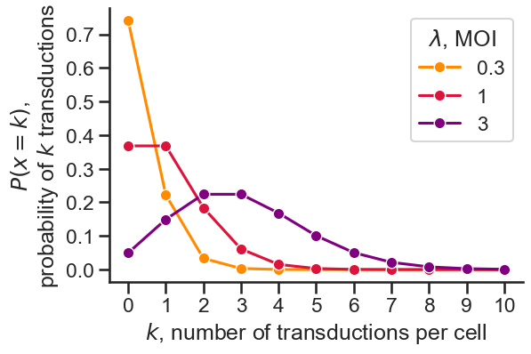

========================
Measuring viral titer
========================

Viral titer can be measured in several ways. We mainly use functional titer, in which we measure the fraction of transduced cells expressing the 
viral payload for several different virus volumes. This metric, in units of **transducing units (TU) per volume** accounts for the amount of particles,
their ability to enter cells, and the vector's ability to integrate and express in the cell of interest---which are all necessary for downstream uses of the vector. 
The titer is specific to each batch of virus and, because it relies on expression, transduced cell type. The viral titer can be used in future experiments to standardize 
the **multiplicity of infection (MOI, TU per cell)** in subsequent infections. This controls for differences in viral production efficiency across 
constructs or batches of virus.

Below, the protocol describes transduction with a serial dilution of virus and a flow cytometry readout, then how to use the flow cytometry data to compute viral titer.
Note that expression can be detected easily if one or more of the cargoes is fluorescent, or via staining for non-fluorescent payloads.

Transduction with a serial dilution of virus
---------------------------------------------

This protocol follows the steps to transduce :ref:`plated cells <plated>` or cells :ref:`in suspension <suspension>` using a serial dilution of virus as your
virus-media mix.

1. Begin with a plate containing cells, polybrene, and a fresh half-volume of media.

  **If transducing plated cells:**
     1. Seed cells at an appropriate, known density one day prior (e.g., 10k MEFs or iPSCs) on appropriately coated plates.
     2. On the day of transduction, replace media with a half-volume of fresh media containing 2X polybrene (i.e., 1:500 dilution of 1000X polybrene).
     3. *Optionally*, dissociate a few extra wells and count to determine the current cell count per well. Tip: Resuspend several wells in a very small volume for more accurate counts.

  **If transducing cells in suspension:**
    1. Prepare plates with the appropriate coating.
    2. Dissociate and count cells. Resuspend cells at double the final concentration (e.g., 20k cells in 50 µL fresh media per well for HEK293T cells) with 2X polybrene (i.e., 1:500 dilution of 1000X polybrene).
    3. Remove the coating and add a half-volume of cells to each well (e.g., 50 µL/well in a 96-well plate) using a multichannel pipette. This mix includes the correct total amount of cells and polybrene per well.

2. **Serially dilute each virus in fresh media**, enough for a half-volume per well. Do this in an auxiliary 96-well plate or fresh tubes. Start with a virus volume estimated to 
   transduce most of the cells, then dilute by factors of 2-10 to generate 4-8 dilutions.
  
  To measure titer for several viruses, the easiest way to do this is in an **auxiliary 96-well plate** with a multichannel pipette.
  One way in particular is the following, using 6 two-fold dilutions per virus (half a row on the auxiliary plate), making enough virus-media mix to transduce 2 wells per condition of cells.
  Tip: Make 20% extra mix for each condition to account for pipetting loss. (The flat-bottom plates make pipetting the entire volume difficult.)

  i. Add 120 µL fresh media to all the wells you will use in the auxiliary plate, half a row per virus, with a multichannel. (Fill wells 1-6 in all columns before wells 7-12 in any column, as you will pipet by columns later.)
  
  .. figure:: img/viral-titer-steps1.jpg
    :align: center
    :width: 40%

  ii. Add each virus to a new well in column 1, using enough for 4 wells plus 20% extra (e.g., for a final volume of 4 µL virus/well when added to the cells, add 19.2 µL virus to column 1).
  
  .. figure:: img/viral-titer-steps2.jpg
    :align: center
    :width: 50%
  
  iii. Pipet additional media into column 1 to bring the total well volume to 240 µL. (If you are using the same volume of each virus, you may wish to do this with the multichannel after step 1.)
  
  .. figure:: img/viral-titer-steps3.jpg
    :align: center
    :width: 40%
  
  iv. Using the multichannel, pipet in column 1 to mix, then transfer 120 µL to column 2. Repeat for columns 3-6.

  .. figure:: img/viral-titer-steps4.jpg
    :align: center
    :width: 80%

  v. The final auxiliary plate now has 6 serial dilutions (columns) per virus (rows). Columns 1-5 have 120 µL/well, and column 6 has 240 µL/well.

  .. figure:: img/viral-titer-final-auxiliary-plate.jpg
    :align: center
    :width: 40%

  .. note::
    Alternatively, you can use one of these spreadsheets (`1 <https://mitprod.sharepoint.com/:x:/s/GallowayLab/EQEnStlTAd1NqKOPG0S18LIBFpaybN1_KckEwNsxueirOw?e=V5Gy4G>`_, `2 <../../_static/files/MOItemplate.xlsx>`_)
    to compute dilution volumes / virus amounts to avoid making 2x volume of the final dilution. Note that this pipetting is less amenable to the multichannel.  

3. **Add a half-volume per well of the virus-media mix to the plate from step 1** containing cells, polybrene, and fresh media. Pipet gently to mix.

  If using the auxiliary plate as described above, this can be done by pipetting 50 µL/well with the multichannel, columnwise. Tip: It is okay to use the same tips if you start with the 
  most dilute column and mix carefully.

  .. figure:: img/viral-titer-final-cells-plate.jpg
    :align: center
    :width: 40%

4. The plate now contains a full well volume (e.g., 100 µL/well for a 96-well plate) of virus, cells, polybrene, and fresh media. Return the plate to the incubator, or
   :ref:`spinfect <spinfection>`, whichever you plan to do for subsequent transductions.

5. As in the standard transduction protocol, perform a media change at 1 day post-infection (dpi), making sure to add any inducers so the virus cargo maximally expresses.
6. At 3 dpi (or a similar endpoint you will use for subsequent transductions), collect the cells for :doc:`flow cytometry </protocols/tc/tc-basics/flow_cytometry>`.

.. important::
    Viral particles are no longer present after 3 days AND 2 media changes. Use proper :doc:`virus safety </protocols/tc/virus/virus_safety>` until then.

Computing titer from transduction data
--------------------------------------

From the transduction experiment described above, we obtain fluorescence measurements for known numbers of cells transduced with known volumes of virus.
Note that individual cells with detectable expression may be contain one or more copies of the viral payload, representing at least one transduction event. 

First, let's define the **multiplicity of infection (MOI)**, :math:`\lambda`, as the ratio of viral transducing units (TU) to number of cells, *n*:

.. math:: \lambda = \frac{\text{# TU}}{n}

We can obtain a particular MOI in an experiment by using a calculated **volume of virus**, *v*, if we know the **viral titer**, *t*:

.. math:: \lambda = \frac{t \times v}{n}

Assuming transductions follow a **Poisson process**, where discrete events occur in a fixed interval and events are independent, the expected rate of 
events (transductions) is the MOI, :math:`\lambda`. Then, the probability of *k* events in the interval, or *k* transductions in a cell, is

.. math:: P(x=k) = \frac{\lambda^k e^{-\lambda}}{k!}

We can see that the probability of transductions in a cell increases with :math:`\lambda` (MOI), as expected. Notice that at an MOI of 0.3, the probability
of transduction (:math:`P(x > 0)`) is low, but the probability of multiple transductions (:math:`P(x > 1)`) is negligible; this is useful for ensuring single integrations.
On the other hand, at an MOI of 3, the probability that a cell will not be transduced (:math:`P(x=0)`) is low, useful for ensuring most cells are transduced.

Across a population of cells, we expect the fraction of cells with *k* transductions to reflect the probability of *k* transductions (:math:`P(x=k)`).
However, it is difficult to quantify the exact number of transductions in individual cells with flow cytometry. But we can easily compute the fraction of 
cells with at least one transduction:

.. math::
  \begin{align}
    P(x>0) &= 1 - P(x=0) \\
    &= 1 - \frac{\lambda^0 e^{-\lambda}}{0!} \\
    &= 1 - e^{-\lambda} \\
    &= 1 - e^{v / n \ \times \ t}
  \end{align}

Thus, the flow cytometry data from the experiment above can give us a fraction of expressing cells, which we can use with known values of *v* and *n* (experimental parameters)
to find *t*, the viral titer. To make this calculation more accurate, we can measure the fraction of expressing cells for several different volumes of virus---exactly the 
experiment described above---and curve fit to better estimate the viral titer when measurements are noisy. Note that viral titer has units TU/mL (or TU/µL, if you use virus volumes in µL).

We have written a function in the ``rushd`` Python package to simplify this calculation (coming soon!). See also the example Jupyter notebook in the ``example_training`` repo
on the Galloway lab GitHub (also coming soon).