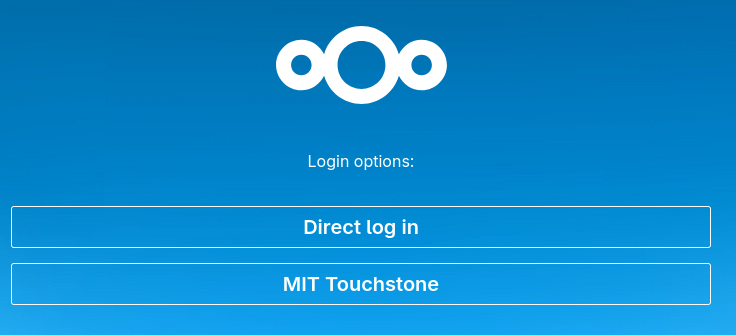
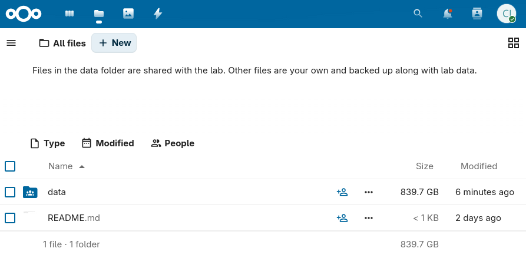

===================================
Day 0: Software and training setup
===================================

Our lab uses a various software and webservices for digital infrastructure and organization.
Before beginning work in the lab, you must complete all required Environment, Health & Safety (EHS) trainings.
New grad students and postdocs should also install or set up accounts for everything listed here; others should ask
their mentor which are essential. 

Check off each task as you complete it on the **lab Onboarding Form** (download the one for `grad students/postdocs </_static/iap_files/2026.07.27_onboarding-form_grad-postdoc.pdf>`_ 
or `undergrads/visiting students </_static/iap_files/2026.07.27_onboarding-form_undergrad-visiting-student.pdf>`_).
The most recent forms are also located in `this folder <https://mitprod.sharepoint.com/:f:/s/GallowayLab/IgDFT2QaHvFyRK8T-mimny_OAWjTpmM18Te5DVKyJORWO10?e=KXd2iO>`_ 
in the lab SharePoint.

.. important:: 
  Most of the software and webservices **require an MIT ID/email**. You should prioritize getting this set up. However, if
  you are waiting on paperwork, you can download most of the software (even if you won't be able to log in yet). After that,
  you may wish to read through the :doc:`Day 1 </training/onboarding/day_1_in-lab>`, :doc:`Day 2 </training/onboarding/day_2_content-trainings>`,
  and linked pages on the protocols site.

.. _ehs:

EHS setup and trainings
=======================
Adding yourself to the lab's training group will register you with the
EHS system and add all necessary trainings to your profile.

1. Go to https://atlas.mit.edu and go to the learning center, through the tab
   on the left:

   .. image:: img/atlas_learning_center.png
    :alt: Learning center
    :align: center
    :width: 30%

2. In the upper right, select "My Profile", then "Update PI/Activities".
3. Add Kate E. Galloway as your PI.
4. Select the following training types (5 total). If you are an undergrad, do not
   select the BL2+ training group.

  .. image:: img/atlas_biosafety_training.png
      :alt: Select the BL1/BL2 and BL2+ training categories, plus then
              performing research with human cells.
      :width: 80%

  .. image:: img/atlas_chemical_training.png
      :alt: Select the 'use potentially hazardous chemicals".
      :width: 80%

  .. image:: img/atlas_cryo_training.png
      :alt: Select the "working with cryogenic liquids" training.
      :width: 80%

5. After submitting, many required trainings will be added to your Learning Center.
   
  - Complete the online trainings. This will likely take a few hours!
  - Some trainings have a required "classroom" component, such as the *Lab Specific Chemical Hygiene*
    training, which will be completed with an in-lab walkthrough.
  - To complete the *Signature: Read Dept. Chemical Hygiene Plan* training, please read the Chemical Hygiene Plan and then sign the attestation form,
    available at: https://web.mit.edu/cheme/resources/lab/ehs/ehs_cert.html

  .. note::
    One of the components of the bloodborne pathogen training is the opportunity to be vaccinated for Hepatitis B or to
    have an antibody titer test for free.

    Most of us were vaccinated for HepB as children, but that vaccine was only ~90% effective, so you may want to get
    the free antibody titer test. You can get a free booster or get doses of a new, more modern HepB vaccine if you
    no longer have HepB antibodies.

6. (*Grad students and postdocs only*) Also add and complete the following:

  - `Autoclave Safety Training <http://web.mit.edu/training/course.html?course=EHS00254w&sys=PS1>`__, required for access to the autoclave/ice room.
  - `Shipping Training <https://us.list-manage.com/x50viiGiYi6?e=3aa52f1b11&c2id=e3a0eacb0edf1dd8510d3cfd3e0194a2>`__ (*new as of June 2026*), required 
    for shipping any materials on behalf of MIT.
  - If you are going to be helping with mouse work, in the "My Profile" tab under "Training Groups" click "Join Another Group" and add the **68N: Mouse** training group.
    Complete the additional trainings. Note that some of these require in-person trainings in the mouse facilities, which can be completed over the next few months.

.. _software: 

Software and webservices
========================

Core webservices
----------------
* Create a `Github account <https://github.com/>`_. You can use either a personal or MIT email.

  * Activate your student benefits by going to https://education.github.com/discount_requests/student_application.
    You will be asked to connect your MIT email and send in a picture of your student ID. (Because
    MIT does not remove emails for alums, they need to confirm active student status.)

* Create a `Zotero account <https://www.zotero.org/user/register>`_. Using a personal email is
  recommended for permanence reasons.
* Create an `ORCID <https://orcid.org/register>`_. Adding all of your active emails is recommended.
* Request an `MIT Google Workspace <https://ist.mit.edu/g-suite/request>`_ account. 
  This provides access to Google services like Drive, Docs, Calendar, etc. Note that it may take 24 hours to activate.
  Alternatively, you can use a personal Google Account for access to a lab calendar.
* (*New grad students and postdocs only*) Create a `Quartzy account <https://www.quartzy.com/>`_. Using your MIT email is recommended.

After creating these accounts, request access to the lab's group on the relevant webservices. Most of these are 
managed by one or two lab members; see the onboarding form for who to contact. Message them with the following information:
your **Kerberos ID (MIT email)**, your **Github username**, your **Zotero username**,
the email you'd like added to the lab **Google Calendar**, and the email associated with your **Quartzy** account.

Then, you must accept the Github invitation to the `GallowayLabMIT organization <https://github.com/gallowaylabmit>`_
and the Zotero invitation to the ``gallowaylab`` group, checking that it appears in your `group list <https://www.zotero.org/groups/>`_.

.. _OneDrive syncing:

Shared storage
--------------
We use two file storage services in the lab: **OneDrive / SharePoint** for "small" files like documents, plasmids,
primers, posters, and so on, and **Smithsonian / Nextcloud** for data files (microscopy images, flow data, NGS data).
We used to use OneDrive for everything, but OneDrive has a 5-TB storage limit, which we reached after seven years.

Luckily, you login to **both** Smithsonian and OneDrive through Touchstone, so you don't need separate accounts.

(1) OneDrive / SharePoint
*************************
OneDrive is Microsoft's file syncing service, and SharePoint is the version for teams (we use these terms interchangeably).
The web interface of OneDrive is slightly clunky, and the official file syncing client is, honestly, not great.
There are sync delays and sometimes things do not update. However, OneDrive has tight integration with Office
products, allowing Google Drive-esque live, multi-person editing of Office documents saved within it.
This is the largest reason why we still use OneDrive.

OneDrive uses "files-on-demand"/"online sync", where all
files in the shared storage *appear* to be accessible, but do not actually take up local
disk space until you open them/unless you manually trigger a download, at which point
the software invisibly downloads files in the background. There's no cost to having
the entire shared folder locally synced. Additionally, you can override this behavior and request
that OneDrive download files before you access them (normally via a right-click menu)

After being given access:

1. If you are not on a recent version of Windows, download the
   `OneDrive client <https://www.microsoft.com/en-us/microsoft-365/onedrive/download>`_.
   Recent versions of Windows come with this preinstalled.
2. Bookmark the web version here: https://mitprod.sharepoint.com/sites/GallowayLab/Shared%20Documents
3. On the web version, select the **Sync** button in the top tab:

    .. image:: img/onedrive_sync.png
        :alt: The sync button is the fourth button across.

4. This will trigger the OneDrive software you installed. It will ask you for a local folder
   to sync into (the default location is usually fine). After several minutes, it will show "OneDrive is up to date", and all files
   should be accessible.

.. _smithsonian_intro:
  
(2) Smithsonian
***************

Smithsonian is the name of our data storage server that lives in the lab. We run this server ourselves,
and it (currently) has a much larger capacity than OneDrive / Google Drive / MIT Dropbox: nearly 45 TB.
Data stored on here is also backed up to an MIT-run backup system called Spectrum Protect / TSM. (If you're curious how this works,
see :doc:`the tech documentation </tech/nas_data_storage>`.) Our storage server is running software called Nextcloud Server. Unlike other cloud-syncing services, Nextcloud (the mostly open-source organization)
does not run servers themselves, so our instance of Nextcloud is accessible at ``smithsonian.mit.edu``.

Like OneDrive, there is both a web interface to quickly browse files, and a local sync client that you can download
that lets you access the files. The Nextcloud sync client also does the same virtual-file / "files-on-demand" that
OneDrive does. You can access the **web interface** at https://smithsonian.mit.edu. You will see a login page that looks like this:

The "Direct login" option is only used for special accounts that are not attached to a person, namely,
the administrator account and the account that the lab computers use. Both of these account details are
in the password database and are accessed as described in :doc:`the tech documentation </tech/nas_data_storage>`.

To login, use the MIT Touchstone option, which will redirect you through Touchstone and eventually land you on the files page:

Lab computers automatically save data into the ``data`` folder and are automatically shared with everyone.
Other files and folders you create within your account are not shared with the lab by default (but are backed up
and accessible with the administrator account).

To setup the **local sync client**, you need to download the Nextcloud client software and point it at Smithsonian.

1. Download the appropriate version of the Nextcloud Files app for your computer from the `Nextcloud site <https://nextcloud.com/install/#desktop-files>`__.
2. Install the software.
3. Launch the software. It will ask you what server to connect to. Type in ``smithsonian.mit.edu``
4. A web browser should open showing the Smithsonian login page. Login with Touchstone. You will reach a
   "grant access" page to allow sync access for this computer.
5. After granting access, return to the sync client. If it asks you to pick a location for the local sync folder, pick
   anything convenient. On macOS, it will appear in the default location: ``/Users/[your-user]/Library/CloudStorage/``.

Coding and collaboration
------------------------
* **Slack** is how we communicate! After `downloading it <https://slack.com/downloads>`__, sign into
  https://gallowaylab.slack.com. In addition to the default channels, you may want to join ``#sequencing`` to get
  your sequencing orders delivered right to you via Slack, and join ``#memes`` for obvious reasons. Ask your mentor or point of contact
  to add you to any other relevant private channels.

* **VS Code:** Having a good *plain-text editor* (not Word) is important for coding, and is ultimately up to personal taste.
  We recommend Visual Studio Code (VS Code), downloadable `here <https://code.visualstudio.com/>`__. However, if you have a different 
  favorite editor, you may use that. If you are used to language-specific IDEs like MATLAB, IDLE, or RStudio, 
  VS Code allows you to do editing, debugging, previewing, source control, etc in a mostly language-agnostic manner; 
  once you customize it to your preferences, you can use it for all of your coding.

  After installing, you should click the extensions button: |extensions_icon|

  .. |extensions_icon| image:: img/vs_code_extensions.png
    :align: middle
  
  and search and install the following extensions (type in the name, click the install button).

  .. |vsc_python| image:: img/vs_code_python.png
    :width: 1000px

  .. |vsc_pylance| image:: img/vs_code_pylance.png
    :width: 200px

  .. |vsc_rst| image:: img/vs_code_rst.png
    :width: 200px

  .. |vsc_jupyter| image:: img/vs_code_jupyter.png
    :width: 200px
  
  .. |vsc_spellcheck| image:: img/vs_code_spellcheck.png
    :width: 200px
  
  .. |vsc_r| image:: img/vs_code_r.png
    :width: 200px

  .. |vsc_rlsp| image:: img/vs_code_r_lsp.png
    :width: 200px
  
  .. |vsc_rst_syntax| image:: img/vsc_rst_syntax.png
    :width: 200px

  .. |vsc_snakemake| image:: img/vsc_snakemake.png
    :width: 200px

  .. |vsc_esbonio| image:: img/vsc_esbonio.png
    :width: 200px

  .. list-table:: Recommended VS Code extensions
    :header-rows: 1
    :width: 100%

    *  - Name
       - Image
       - Description
    *  - Code Spell Checker
       - |vsc_spellcheck|
       - Inline spell checker that is intelligent enough to not flag specific language-specific words, but still can
         spell check comments and variable names.
    *  - Esbonio
       - |vsc_esbonio|
       - Support for editing Sphinx projects, e.g., this protocols site. The live preview function is super helpful!
    *  - Jupyter
       - |vsc_jupyter|
       - Inline Jupyter notebook support. No more need to launch Jupyter in a web browser, just do it inside VS Code!
    *  - Pylance
       - |vsc_pylance|
       - Faster 'language server' for Python, which means the IntelliSense is faster and more accurate.
    *  - Python
       - |vsc_python|
       - Enables Python debugging, running, and IntelliSense (in-line help while typing).
    *  - R (*optional*)
       - |vsc_r|
       - Base language support for R.
    *  - R LSP Client (*optional*)
       - |vsc_rlsp|
       - The VS Code side of the R language server. Before installing this, run ``install.packages("languageserver")``
         inside an R prompt.
    *  - reStructuredText
       - |vsc_rst|
       - Enables reStructuredText support, the language used to write this documentation, among others.
    *  - reStructuredText Syntax highlighting
       - |vsc_rst_syntax|
       - Enables syntax highlighting for reStructuredText.
    *  - Snakemake Language
       - |vsc_snakemake|
       - Snakemake syntax highlighting for editing computational pipelines.
    

* **Git:** For any code/code-like files (LaTeX, other plain-text files), Git is the standard way to share
  and collaborate with others and to track version history.
  
  You must install the base command-line tools from `here <https://git-scm.com/downloads>`__. Select
  your operating system and not the "Download source code" button. For macOS, the easiest way is probably the "Xcode Command Line Tools"
  option. 

  .. tip::
    When installing Git, you may want to change Git's default editor to something other than Vim, such as VS Code.

    When asked about adjusting the PATH environment, choose the **Git from the command line and also from 3rd-party software**
    option; this makes sure all the other software also has Git access. All other defaults are fine, but can be changed
    if you want.

  After installation, you should set your global identity on that computer, i.e., the name and email that gets stored alongside the work you do.
  To do so, open a terminal (Terminal on macOS, Powershell on Windows) and type the following lines (without the beginning ``$``, which identifies here that we are typing this into a terminal),
  substituting your name and email (giving an email you associated with your Github account).
  If you're not familiar with the terminal, check out our intro :doc:`here </training/onboarding/the_shell>`.

  .. code-block:: console

    $ git config --global user.name "Full Name"
    $ git config --global user.email email_address@example.com

  For a comprehensive introduction to Git, check out our intro :doc:`here </training/onboarding/git_intro>` or `this tutorial <https://git-scm.com/book/en/v2>`_
  from Git.

* *(Optional)* **Github Desktop:** This program is a good basic GUI Git tool, in case the command line interface or built-in editor interfaces
  aren't for you. Download it `here <https://desktop.github.com/>`__.
  
* **Python:** Python is an excellent "Jack of all trades" language; we use it extensively. If you are on macOS, you may have
  Python3 pre-installed; you can check by typing ``python3`` at a terminal. If you do not have Python preinstalled, you should
  download it `here <https://www.python.org/downloads/>`__. Click the latest version download from the top, then scroll down
  and select the 64-bit installer for your OS.

  When installing, select **Add Python to PATH**; this ensures that when you type ``python`` at a terminal, you get this version you
  just installed. Other software can also access this "default" installation. After installing, restart VS Code.

  .. admonition:: What is PATH?

    ``PATH`` is a "environment variable", i.e., something that any program running
    in the "environment" of your computer can access. It is a list of folders where software can be found.
    In a command line, when you type a program name (like ``ls``, or ``python``, or ``git``)
    without specifying where the program is, your computer iterates through every folder in ``PATH`` to see
    if it can find the program there.

    Bonus fact: virtual environments work by temporarily messing with ``PATH``, redirecting calls to programs like Python to
    the virtual environment install.

  .. admonition:: On snakes and Anaconda

    If you have Anaconda installed and don't have an explicit reason to need it (e.g., conda-only packages),
    it is recommended to uninstall Anaconda and install Python directly this way.
    
    With modern Python, the benefits that Anaconda initially brought to the field (virtual environments
    and pre-compiled packages) are now integrated into the normal Python ecosystem, making Anaconda
    unnecessary. We also don't want multiple Python versions competing.
  
  To make sure the install worked, open a new terminal and type ``python`` (or ``python3`` on macOS), checking that the output looks
  similar to the following. Then exit the Python prompt by typing ``exit()``.

  .. code-block:: console
      
      $ python
      Python 3.9.1 (tags/v3.9.1) [MSC v.1916 64 bit (AMD64)] on win32
      Type "help", "copyright", "credits" or "license" for more information.

  .. admonition:: Fixing Python “command not found” (Windows & macOS)
   :class: warning
   
   If you see errors like

     - ``'python' is not recognized as an internal or external command``
     - ``command not found: python``

   then you likely forgot do the above step (clicking Add Python to PATH),
   or you didn't restart VS Code. The easiest way to fix this is to simply **uninstall Python and reinstall it**, while
   clicking the box. If you don't want to do that for some reason, you can manually add Python to PATH. 

   **Windows**

    You need to find where Python is installed. This will vary! The easiest way to do this
    is just search for ``python.exe`` to locate where that folder is. This might look something like

      ``C:\Users\<USERNAME>\AppData\Local\Python\python-3.14\python.exe``

    Then:

    1. Press the Windows key on your keyboard to bring up the search.
    2. Search for *Edit environment variables*
    3. In the box that shows up, click *Edit the system environment variables*.
    4. Click *Environment Variables*.
    5. In the **User variables for <USERNAME>** box, find the **Path** variable and click *Edit*.
    6. In the list of directories that shows up, click *New* and add the folder containing Python identified earlier.
    7. Click OK and **restart any open terminals and VS Code to pick up the change**. (If you're unsure, log out and log back in to your computer.)
   
   **macOS / Linux**

    On macOS and Linux, you handle the path by editing your shell configuration file, normally either
    at ``~/.zshrc`` for zsh or ``~/.bashrc`` for Bash.

    In these lines, you should add an export call to add the Python location to the end of path, like:

    ``export PATH="$PATH:/path/to/python/that/you/found``

* *(Optional)* **R:** Many bioinformatics tools are written in R, but there are also many good Python versions. You can install this now, or wait to see if you need it later.
  From `here <http://lib.stat.cmu.edu/R/CRAN/>`_, download the main package (macOS) or both the ``base`` entry and the ``Rtools`` entry (Windows).
* *(Optional)* **RStudio:** If you don't feel like using VS Code for your R work, the excellent, well-polished
  standard IDE is RStudio Desktop, downloadable `here <https://rstudio.com/products/rstudio/download/#download>`__.

Experimental software
---------------------
* **SnapGene:** We use SnapGene for molecular cloning and plasmid design. Download it through MIT IST 
  `here <https://downloads.mit.edu/released/snapgene/vendor-registration.html>`__,
  and access the registration code
  `here <http://downloads.mit.edu/released/snapgene/group-name_registration-code.txt>`__
  (MIT login required for both links).
* **FlowJo:** We have a single license on lab computers for analyzing flow cytometry data; we can show you how it works in-lab.
* *(Optional)* **FIJI:** For simple image analysis, Fiji (ImageJ) gives a nice GUI interface. Download it from https://fiji.sc
* *(Optional)* **CellProfiler:** CellProfiler is an excellent tool for doing image cytometry (analyzing cell-by-cell in image data).
  In contrast to the GUI-only tools built into the Keyence software, CellProfiler enables repeatable, pipelinable analyses.
  Download it from https://cellprofiler.org/

Other
-----
* **Zotero:** Zotero is an excellent free, open-source citation manager. After downloading Zotero from https://www.zotero.org/,
  it should prompt you to install the Zotero Connector, a browser plugin that lets you download paper citations with one click.
  If it doesn't prompt you, download the connector `here <https://www.zotero.org/download/connectors>`__. We also have a shared 
  Zotero group, which you should have requested access to above, to accumulate citations when writing manuscripts.

  Several helpful plugins can be downloaded; the recommended ones are:

  .. list-table:: Recommended Zotero plugins
    :header-rows: 1
    :width: 100%

    *  - Name
       - Description
    *  - `ZotFile <http://zotfile.com/>`__
       - Enables useful file operations, such as extracting annotations from a marked-up PDF,
         transferring new papers to a tablet for annotation, and auto-file renaming.
    *  - `Zutilo <https://github.com/wshanks/Zutilo>`__
       - Enables helpful tagging operations, such as the ability to copy/paste tags or easily add paper relationships.
    *  - `Better Bibtex <https://retorque.re/zotero-better-bibtex/>`__
       - If you plan to use LaTeX, install this plugin before exporting to BibTeX. This addon makes nice-looking,
         stable citation keys that do not change on export.

  .. admonition:: Downloading Zotero plugins through Firefox

    Since Zotero is built on modified Firefox, Zotero plugins appear similar to Firefox plugins. If downloading
    these plugins through Firefox, you will need to explicitly right click -> "download target"; left-clicking on download
    links will attempt to install the Zotero plugin as a Firefox plugin, which will fail.

* **Better Quartzy:** 
  
  .. admonition:: TODO
    
    Unfortunately, the Quartzy interface updated, so our userscript to customize the appearance is broken. :(

  While Quartzy is great for inventory purposes and the interface for the plasmid 
  database isn't too bad, the web interface leaves a lot to be desired. By default,
  you can't really read the plasmid names even after you move the "CAS #"" field to the second position:

  .. image:: img/quartzy_pre_enhancer.png
      :align: center
      :width: 80%

  To fix this, there is a Quartzy enhancer to make the plasmid field larger and to directly list the antibiotic resistance 
  (Amp/Kan/Chlor) below the plasmid.

  .. image:: img/quartzy_post_enhancer.png
      :align: center
      :width: 80%

  This feature is implemented using something called **userscripts**; these are small Javascript
  scripts that get injected into webpages; effectively they are mini browser extensions.

  To set this up, install a userscript manager like `Tampermonkey <https://www.tampermonkey.net/>`__.

  Then, click on this link to add the userscript: https://gist.github.com/meson800/f28e64d532da9b0fe2a1d22480ea5cda/raw/quartzy_enhancer.user.js

  Or, in the Tampermonkey Utilities tab, you can use the **install from URL** option:

  .. image:: img/tampermonkey_install_from_url.png
      :align: center
      :width: 70%

  
.. _graphics:

* **Adobe Creative Cloud:**  MIT has a site license for students and staff (but unfortunately, not for affiliates). After installing the
  `Creative Cloud application <https://www.adobe.com/creativecloud/desktop-app.html>`__, select "Work/School account" and
  login with your MIT credentials. You may have to wait 24 hours for activation after your first login. You should
  install **Acrobat** (for viewing PDFs) and **Illustrator** (for drawing graphics).

  .. note::
    As a free and open-source alternative to Adobe Creative Cloud, you can also check out **Inkscape** (download
    `here <https://inkscape.org/release/inkscape-1.0.1/>`__). Inkscape and Illustrator have many similar but not completely overlapping features.
    Inkscape's PDF importer (Cairo) may be superior for importing vector images from manuscript PDFs. Inkscape may be useful to know 
    if you don't want to pay for Creative Cloud later; however, we use Adobe software for creating graphics and figures in lab.

* **Color palettes:** Having nice color-blind friendly, distinct colors is helpful when you begin creating graphics.
  Palettes help unify figures and convey consistent information via color.

  You can download pre-created palettes for both `Illustrator <../../_static/iap_files/cat20_colors.ase>`__
  and `Inkscape <../../_static/iap_files/cat20_colors.gpl>`__
  for the well-known Category20/20b color set, which is color-blind friendly (and becoming the default in more and more
  software packages):

  .. image:: img/illustrator_swatches.png
    :align: center
    :width: 40%
  
  To use these palette files, see the `Illustrator documentation <https://helpx.adobe.com/illustrator/using/using-creating-swatches.html#share_swatches_between_applications>`__
  ("Create and open swatch libraries") or the `Inkscape documentation <https://inkscape-manuals.readthedocs.io/en/latest/palette.html>`__.

* **Fonts:** *Helvetica Neue* is a good sans-serif font that is based on everyone's favorite font, Helvetica. 
  While not required, many people in lab use this font, so their files (e.g., PowerPoint, Illustrator) won't render well if you don't have it installed.
  First, download it `here </_static/iap_files/HelveticaNeue.zip>`__ (macOS, Linux) or `here </_static/iap_files/WinNeue.zip>`__ (Windows).
  Then, unzip the folder, select all the ``.tff`` files, and double click to open, which should prompt installation. Alternatively, 
  right click and select "Install font".

  For a good monospaced/code/terminal font, *Fira Code* is excellent (download `here <https://github.com/tonsky/FiraCode/releases>`__).
  Besides looking nice, Fira Code has something called **font ligatures**. These are originally defined for special
  letter combinations, like æ for adjacent ae. In Fira Code, common programming combinations are given
  special ligature symbols that appear as you type normally. You often have to enable ligatures in the editor
  you are using.

  .. image:: img/fira_code.png
      :align: center
      :width: 80%